# Миграция реляционных баз данных с проприетарных СУБД на открытые решения: на примере перехода с MS SQL Server на PostgreSQL

### Актуальность перехода на open-source решения
Переход на открытые решения, в частности баз данных, поможет проекту снизить его себестоимость, сохранить бизнесу деньги которые могли бы быть потрачены на другие полезные вещи, например масштабирование (покупка того же железа).
  
Стоимость MS SQL Server зависит от ряда факторов, таких как версия, типы лицензий, количество ядер и пользователей, а также дистрибьютор. 
- Например, версия SQL Server 2022 Standard Edition с 1 CAL может стоить от **59 916 руб.** 
- Версия SQL Server 2019 Standard Edition может стоить от **179 950 руб.** 
  подробнее:
[https://www.microsoft.com/ru-ru/sql-server/sql-server-2019-pricing](https://www.microsoft.com/ru-ru/sql-server/sql-server-2019-pricing)  
    
- Oracle в марте 2022 г. присоединилась к антироссийским санкциям и приостановила работу в России.
  
Существуют бесплатные версии для разработки и тестирования, такие как SQL Server Developer и SQL Server Express. 
Бесплатная версия SQL Server, например Express, имеет ограничения по функционалу по сравнению с платными версиями. 12. Некоторые отличия: Размер базы данных: в Express одна база не может быть больше 10 Гб, а размер буферного пула ограничен 1,4 Гб. .   
Также отсутствует агент SQL Server, что исключает возможность создания запланированных заданий.


**PostgreSQL**  здесь является отличным выбором для бизнеса, ключевыми положительными стронами которого являются:
• Стабильность; 
• Безопасность; 
• Цена; 
• Документация; 
• Типы данных; 
• Расширяемость; 
• Активное сообщество.

## Структура микросервисного приложения, и баз данных
Для общей картины, представлю схему микросервисной архитектуры вэб приложение онлайн магазина:

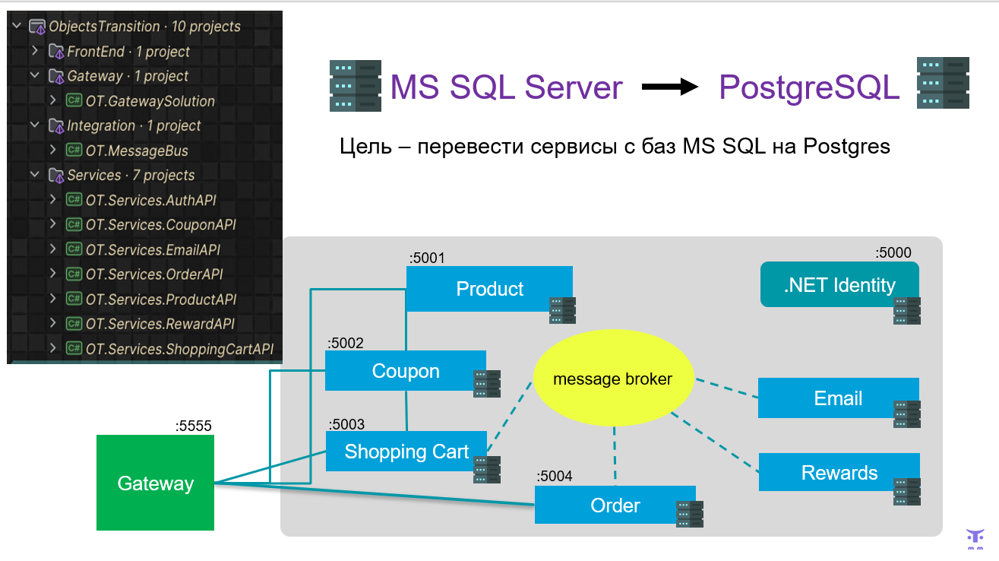

Одно из приемуществ микросервисной архитектуры - каждый сервис можно переключить по отдельности, причем часть сервисов, если есть на то необходимость - может продолжать работать на базах MS SQL.

**Список сервисов:** (Web Api и внутренние сервисы)
- OT.Services.AuthAPI  - .Net Identity (использую готовую систему управления пользователями, определяет роли, права доступа, регистрацию пользователей сервисов)
		База данных содержит стандартный набор таблиц  .Net Identity для хранения информации о пользователях и управления их доступом.
Все персонажи в базе являются вымышленными и объектов, ни одна конфеденциальная информация не пострадала...

Бизнес сервисы:
- OT.Services.CouponAPI  - купоны покупателей
- OT.Services.OrderAPI  - управление заказами
- OT.Services.ProductAPI - управление продуктами
- OT.Services.ShoppingCartAPI - управление корзиной покупателя

Служебные внутренние сервисы:
- OT.Services.EmailAPI  - сервис отправки сообщений пользователям
- OT.Services.RewardAPI - сервис расчета бонусов и вознаграждений

Ocelot в качестве Getaway

- В каждом сервисе - слой репозиторий, который на порядки снижает стоимость поддержки и упращает процесс переключения с одной базы данных на другие.
-  Цель - перевести сервисы на базы PostreSQL c переносом данных, не нарушив работу приложений.

### Базы данных
- У каждого сервиса своя отдельная база на Microsoft SQL Server.

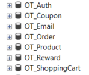

Схема OT_Auth

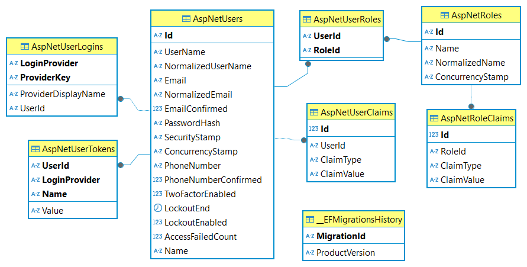

Схема OT_Product

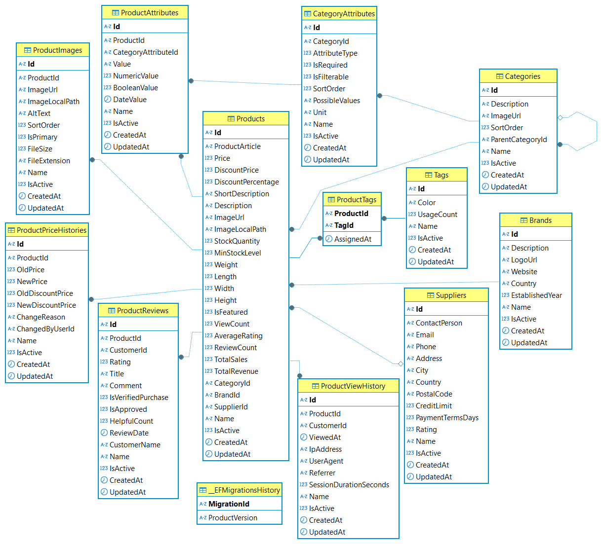

Для примера миграции баз, буду использовать в основном 2 этих сервиса, они покрывают все основные виды связей между таблицами. Остальные базы сервисов мигрировались по аналогии.

В каждой базе присутствует таблица __EFMigrationHistory - это служебная таблица, которую автоматически создаёт Entity Framework для отслеживания миграций базы данных (Хранит историю всех применённых миграций).

#### База OT_Product 
Размер базы OT_Product в MS SQL
```sql
SELECT CONVERT(DECIMAL(10,2), SUM(size)/128.0/1024) AS TotalSizeGB
FROM sys.database_files;
```
**5.14 Gb**, но это с учетом  **выделенного место** на диске (allocated space, включая логи,  свободное место внутри файлов БД)

```sql
-- Размер фактически используемого пространства
SELECT CONVERT(DECIMAL(10,2), 
SUM(CAST(FILEPROPERTY(name, 'SpaceUsed') AS BIGINT))/128.0/1024) AS UsedSpaceGB
FROM sys.database_files
WHERE type = 0; -- только данные без логов 
```
**4.66 Gb**

```sql
SELECT t.name AS TableName,
    SUM(s.row_count) AS Rows,
    SUM(s.used_page_count * 8) / 1024 AS SizeMb
FROM sys.tables t
JOIN sys.dm_db_partition_stats s ON t.object_id = s.object_id
WHERE  t.is_ms_shipped = 0 --исключаею системные таблицы
    AND s.index_id IN (0, 1) 
GROUP BY  t.name
ORDER BY  t.name
```
Результат, таблицы колличество записей, и место занимаемое таблицей:

| TableName             |    Rows | SizeMb |
| --------------------- | ------: | -----: |
| __EFMigrationsHistory |       1 |      0 |
| Brands                |     500 |      0 |
| Categories            |     500 |      0 |
| CategoryAttributes    |    2000 |      0 |
| ProductAttributes     |  800000 |    252 |
| ProductImages         |  300000 |    315 |
| ProductPriceHistories |  150000 |     60 |
| ProductReviews        |  500000 |    978 |
| Products              |  200000 |   1569 |
| ProductTags           |  210000 |     21 |
| ProductViewHistory    | 1000000 |    653 |
| Suppliers             |    1000 |      0 |
| Tags                  |     300 |      0 |


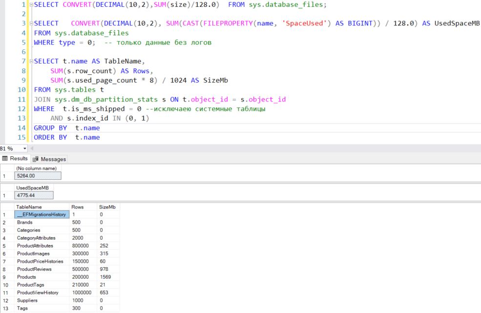

#### База OT_Auth 
Размер базы OT_Auth в MS SQL
```sql
SELECT CONVERT(DECIMAL(10,2),SUM(size)/128.0)  FROM sys.database_files;
```
**464.00 Mb**, место занимаемое на диске

```sql
-- Размер данных без свободного места, воспользуемся системной функцией:
SELECT   CONVERT(DECIMAL(10,2), SUM(CAST(FILEPROPERTY(name, 'SpaceUsed') AS BIGINT)) / 128.0) AS UsedSpaceMB
FROM sys.database_files
WHERE type = 0;  -- только данные без логов  
```
**171.06 Mb**

```sql
SELECT t.name AS TableName,
    SUM(s.row_count) AS Rows,
    SUM(s.used_page_count * 8) / 1024 AS SizeMb
FROM sys.tables t
JOIN sys.dm_db_partition_stats s ON t.object_id = s.object_id
WHERE  t.is_ms_shipped = 0 --исключаею системные таблицы
    AND s.index_id IN (0, 1) 
GROUP BY  t.name
ORDER BY  t.name
```
Результат, таблицы колличество записей, и место занимаемое таблицей:

| TableName             |   Rows | SizeMb |
| --------------------- | -----: | -----: |
| __EFMigrationsHistory |      2 |      0 |
| AspNetRoleClaims      |    150 |      0 |
| AspNetRoles           |     15 |      0 |
| AspNetUserClaims      |  15000 |      2 |
| AspNetUserLogins      |   5000 |      1 |
| AspNetUserRoles       |  19616 |      2 |
| AspNetUsers           | 100000 |     97 |
| AspNetUserTokens      |  10000 |      2 |

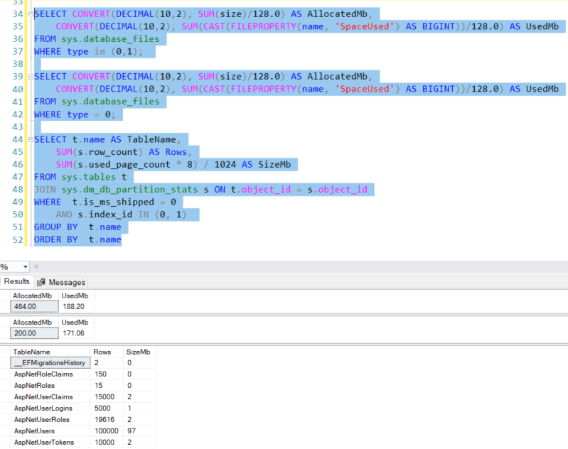


## Развертывание PostgreSQL в Docker контейнере.
docker-compose.yml
```yml
version: '3.8'

services:
  postgres:
    image: postgres:17
    container_name: pg17
    ports:
      - "5431:5432"
    environment:
      POSTGRES_PASSWORD: moi_porol
      POSTGRES_USER: postgres                       
      POSTGRES_DB: postgres                        
      PGDATA: /var/lib/postgresql/data/pgdata      
    volumes:
      - pg17_data:/var/lib/postgresql/data
      - ./backups:/backups
    restart: unless-stopped
    healthcheck:                                   
      test: ["CMD-SHELL", "pg_isready -U postgres"]
      interval: 5s
      timeout: 5s
      retries: 5

volumes:
  pg17_data:
```

```shell
> docker-compose up -d

> docker exec -it pg17 psql -U postgres

psql (17.5 (Debian 17.5-1.pgdg120+1))
Type "help" for help.
postgres=# 
```
Развернул Postrges в докер контейнере
Подключился к базе postgres. Теперь можно таргетировать порт 5431 для накатки схем миграциями средствами Entity Framework.

## Миграции структуры баз данных :
Учитывая особенности работы приложения, паттерн репозиторий, базы MS SQL создавались средствами ORM Entity Framework используя Code First подход (на основе моделей приложения создаются таблицы),
По-этому, лучшим способом миграции структуры баз, является переключение провайдера с Microsoft.EntityFrameworkCore.SqlServer на Npgsql.EntityFrameworkCore.PostgreSQL и пересоздание миграционных файлов Entity Framework.
Далее **EF-миграцией** буду называть механизм миграций Entity Framework.

До этого сервисы работают с EF провайдером для общения с сервером MS SQL, используя пакеты типа Microsoft.EntityFrameworkCore.SqlServer, 
чтобы поменять провайдер на работающий с Postgres, первым делом необходимо уставить nuget пакеты Npgsql и Npgsql.EntityFrameworkCore.PostgreSQL, поменяю их в проекте каждого сервиса:
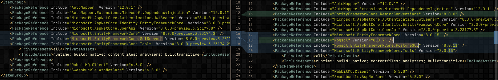
Теперь можно указать его при добавлении контекста источника данных сервиса, вместо использумого с MS SQL:

Далее меняю строку подключения, указывая адрес PostgreSQL развернутого в Docker контейнере (про это будет ниже).
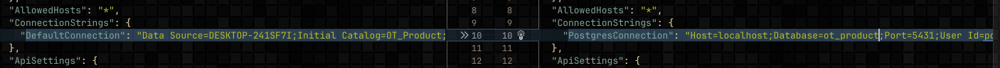
И так будет сделано для каждого сервиса - указаны их базы.

После того как все необходимые nuget-пакеты установленны, файлы конфигурации на основе которых по моделям строятся структуры таблиц можно не трогать, они в целом работают универсально, и при помощи нового провайдера Npgsql будут просто сгенерированны под особенности Postgres
Вот так, например, выглядит конфигурация таблицы **brand** базы **Product** сервиса **OT_Product** (остальные файлы конфигураций и примеры миграционных файлов в приложенном архиве)
```csharp
public class BrandConfiguration : IEntityTypeConfiguration<Brand>  
{  
    public void Configure(EntityTypeBuilder<Brand> builder)  
    {        builder.HasKey(b => b.Id);  
            builder.Property(b => b.Id)  
            .ValueGeneratedOnAdd();  
            builder.Property(b => b.Name)  
            .IsRequired()  
            .HasMaxLength(255);  
            builder.Property(b => b.Description)  
            .HasMaxLength(1000);  
            builder.Property(b => b.LogoUrl)  
            .HasMaxLength(255);  
            builder.Property(b => b.Website)  
            .HasMaxLength(255);  
            builder.Property(b => b.Country)  
            .HasMaxLength(100);  
            builder.Property(b => b.CreatedAt)  
            .IsRequired()  
            .HasDefaultValueSql("CURRENT_TIMESTAMP");  
            // Индексы  
        builder.HasIndex(b => b.Name)  
            .IsUnique()  
            .HasDatabaseName("IX_Brand_Name");  
            builder.HasIndex(b => b.Country)  
            .HasDatabaseName("IX_Brand_Country");
```
И после создания файлов EF-миграций инструментами EF, получаю следущую "инструкцию" для создания таблицы **brands** :
```csharp
protected override void Up(MigrationBuilder migrationBuilder)  
{migrationBuilder.CreateTable(  
        name: "brands",  
        columns: table => new  
        {  
            id = table.Column<Guid>(type: "uuid", nullable: false),  
            description = table.Column<string>(type: "character varying(1000)", maxLength: 1000, nullable: true),  
            logo_url = table.Column<string>(type: "character varying(255)", maxLength: 255, nullable: true),  
            website = table.Column<string>(type: "character varying(255)", maxLength: 255, nullable: true),  
            country = table.Column<string>(type: "character varying(100)", maxLength: 100, nullable: true),  
            established_year = table.Column<int>(type: "integer", nullable: false),  
            name = table.Column<string>(type: "character varying(255)", maxLength: 255, nullable: false),  
            is_active = table.Column<bool>(type: "boolean", nullable: false, defaultValue: true),  
            created_at = table.Column<DateTimeOffset>(type: "timestamp with time zone", nullable: false, defaultValueSql: "CURRENT_TIMESTAMP"),  
            updated_at = table.Column<DateTimeOffset>(type: "timestamp with time zone", nullable: true)  
        },  
        constraints: table =>  
        {  
            table.PrimaryKey("pk_brands", x => x.id);  
        });

		migrationBuilder.CreateIndex(  
		    name: "ix_brands_country",  
		    table: "brands",  
		    column: "country");  
		  
		migrationBuilder.CreateIndex(  
		    name: "ix_brands_name_unique",  
		    table: "brands",  
		    column: "name",  
		    unique: true);  
		  
		migrationBuilder.CreateIndex(  
		    name: "ix_brands_is_active",  
		    table: "brands",  
		    column: "is_active");  ...
```

При этом существующие фалы EF-миграций под MS SQL сначало удалил и пересоздал новые под Postgres:
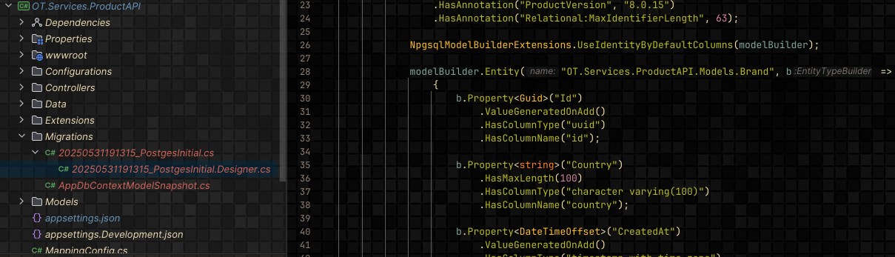
Коротко о файлах EF-миграций:
- **`20250531191315_PostgesInitial.cs`**  основной файл миграции - инструкциями "что нужно сделать с базой"
        - Содержит `Up()` - команды для применения миграции (создание таблиц, полей)
        - Содержит `Down()` - команды для отката миграции (удаление изменений)
- **`20250531191315_PostgesInitial.Designer.cs`** технический файл с "снимком" модели на момент миграции
        - Хранит метаданные о структуре базы
        - Нужен EF для сравнения изменений
- **`AppDbContextModelSnapshot.cs`**  "снимок"  текущего состояния всей базы данных
        - Запоминает актуальную структуру всех таблиц
        - Помогает EF понимать, какие миграции уже применены
        - Обновляется при каждой новой миграции

А отличия в командах EF-миграций по созданию таблиц получаются примерно такими (пример таблицы AspNetUsers)
MS
```csharp
migrationBuilder.CreateTable(  
    name: "AspNetUsers",  
    columns: table => new  
    {  
        Id = table.Column<string>(type: "nvarchar(450)", nullable: false),  
        UserName = table.Column<string>(type: "nvarchar(256)", maxLength: 256, nullable: true),  
        NormalizedUserName = table.Column<string>(type: "nvarchar(256)", maxLength: 256, nullable: true),  
        Email = table.Column<string>(type: "nvarchar(256)", maxLength: 256, nullable: true),  
        NormalizedEmail = table.Column<string>(type: "nvarchar(256)", maxLength: 256, nullable: true),  
        EmailConfirmed = table.Column<bool>(type: "bit", nullable: false),  
        PasswordHash = table.Column<string>(type: "nvarchar(max)", nullable: true),  
        SecurityStamp = table.Column<string>(type: "nvarchar(max)", nullable: true),  
        ConcurrencyStamp = table.Column<string>(type: "nvarchar(max)", nullable: true),  
        PhoneNumber = table.Column<string>(type: "nvarchar(max)", nullable: true),  
        PhoneNumberConfirmed = table.Column<bool>(type: "bit", nullable: false),  
        TwoFactorEnabled = table.Column<bool>(type: "bit", nullable: false),  
        LockoutEnd = table.Column<DateTimeOffset>(type: "datetimeoffset", nullable: true),  
        LockoutEnabled = table.Column<bool>(type: "bit", nullable: false),  
        AccessFailedCount = table.Column<int>(type: "int", nullable: false)  
    },  
    constraints: table =>  
    {  
        table.PrimaryKey("PK_AspNetUsers", x => x.Id);  
    });
```
Postgres
```csharp
migrationBuilder.CreateTable(  
    name: "AspNetUsers",  
    columns: table => new  
    {  
        Id = table.Column<string>(type: "text", nullable: false),  
        Discriminator = table.Column<string>(type: "character varying(21)", maxLength: 21, nullable: false),  
        Name = table.Column<string>(type: "text", nullable: true),  
        UserName = table.Column<string>(type: "character varying(256)", maxLength: 256, nullable: true),  
        NormalizedUserName = table.Column<string>(type: "character varying(256)", maxLength: 256, nullable: true),  
        Email = table.Column<string>(type: "character varying(256)", maxLength: 256, nullable: true),  
        NormalizedEmail = table.Column<string>(type: "character varying(256)", maxLength: 256, nullable: true),  
        EmailConfirmed = table.Column<bool>(type: "boolean", nullable: false),  
        PasswordHash = table.Column<string>(type: "text", nullable: true),  
        SecurityStamp = table.Column<string>(type: "text", nullable: true),  
        ConcurrencyStamp = table.Column<string>(type: "text", nullable: true),  
        PhoneNumber = table.Column<string>(type: "text", nullable: true),  
        PhoneNumberConfirmed = table.Column<bool>(type: "boolean", nullable: false),  
        TwoFactorEnabled = table.Column<bool>(type: "boolean", nullable: false),  
        LockoutEnd = table.Column<DateTimeOffset>(type: "timestamp with time zone", nullable: true),  
        LockoutEnabled = table.Column<bool>(type: "boolean", nullable: false),  
        AccessFailedCount = table.Column<int>(type: "integer", nullable: false)  
    },  
    constraints: table =>  
    {  
        table.PrimaryKey("PK_AspNetUsers", x => x.Id);  
    });
```

т.е они будут отличаться на особенности описания типов, используемых провайдером Npgsql в отличаи от MS SQL
вот пример таблицы базы сервиса  **OT_Order**:
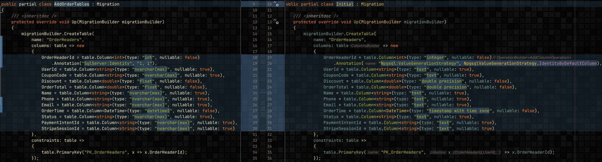
Сохраняется инкрементальное увеличение в записи поля Id, меняются типы, например

**nvarchar(max)** стал типом **text**,

**float**  - типом  **double precision**

**datetime2**  - типом **timestamp with time zone**

Все сопоставления типов MS SQL и Postrges можно посмотреть тут: https://www.sqlines.com/sql-server-to-postgresql#data-types

C существующими фалами настроек получаются как и ожидолось объекты в PascalCase, 

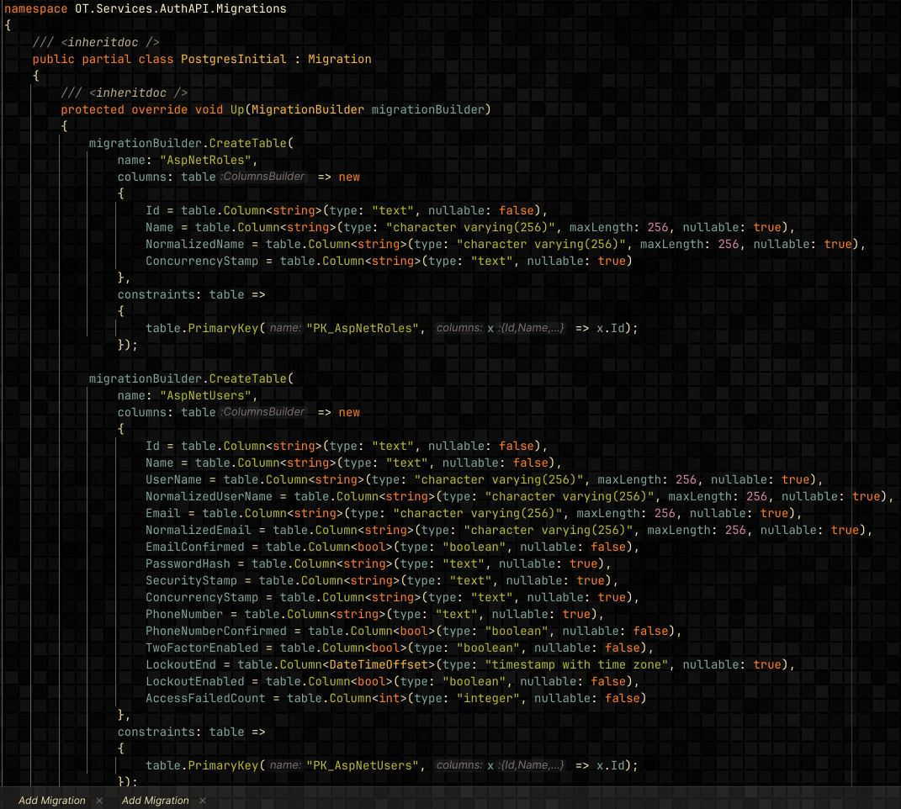
например по умолчанию, таблицы OT_Auth будут называться после выполнения миграций AspNetRoles, AspNetUsers
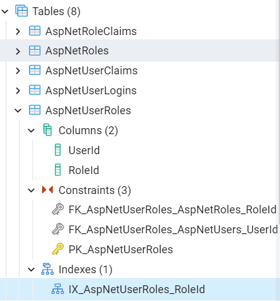

Есть 2 выхода решения проблемы несоответствия стилей по наименованию объектов между MS SQL и PostgeSQL:
-  Явно прописывать в настройках конфигурации Entity Framework
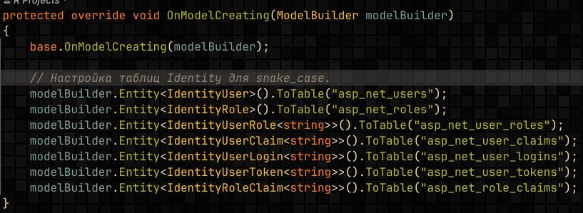
 - Или нашелся полезный Nuget-пакет **EFCore.NamingConventions**  https://github.com/efcore/EFCore.NamingConventions , который решает проблему и автоматически приводит всё в любой указаный формат, актуально если очень много конфигураций таблиц уже описанно руками в конвенциях других баз.
Просто добавляется при добавлении провайдера
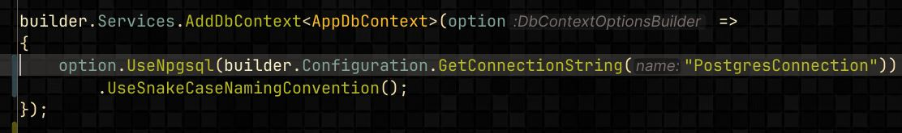
поддерживает самые разные кейсы, например:
- UseSnakeCaseNamingConvention: `FullName` becomes `full_name`
- UseLowerCaseNamingConvention: `FullName` becomes `fullname`
- UseCamelCaseNamingConvention: `FullName` becomes `fullName`
- UseUpperCaseNamingConvention: `FullName` becomes `FULLNAME`
- UseUpperSnakeCaseNamingConvention: `FullName` becomes `FULL_NAME`

Соответственно c использованием .UseSnakeCaseNamingConvention, после пересоздания файла EF-миграций получаю: названия таблиц asp_net_roles, asp_net_users...
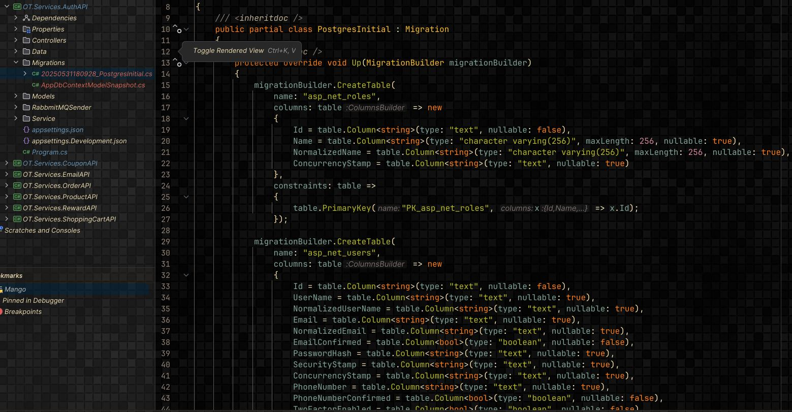
единственное что, именно с объектами  .Net Identity название ключей начинались c FK, а индексов IX - их пришлось привести в нижний регистр вручную

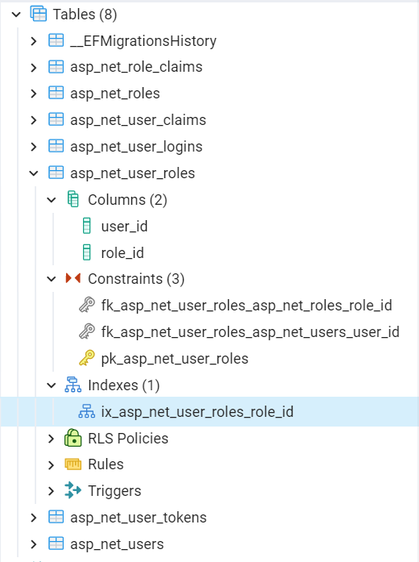
Выходят в итоге после выполнения EF-миграций.
- Ну и всегда можно оставить такой же стиль который используется в MS SQL просто придется кавычить каждый объект в запросе


EF-Миграции для создания структуры базы выполняются специальными командами пакета Microsoft.EntityFrameworkCore.Tools
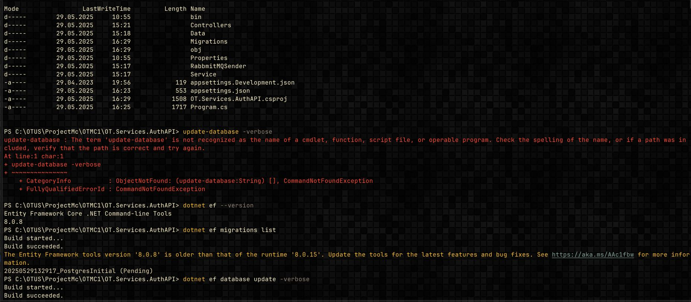


Одним из подходов переноса данных средствами EF являетсе, например перенос данных-справочников, которые определяются единоразово и редко меняются - их можно сидировать при выполнении накатки схем на базу с добавлением опций **.HasData**. Здесь я такой не рассматриваю, как и перенос средствами ETL и использование 2ух контекстов, потому что хочу проверить работу именно инструментов и расширений PostgreSQL о чем дальше и пойдет речь.

## Миграция данных PostgreSQL : **Foreign Data Wrapper**

Основным инструментом переноса данных выбрал https://github.com/tds-fdw/tds_fdw за  удобство, простоту, и прямолинейность (подключаемся непосредственно к таблицам MS SQL)

```shell
apt-get update
apt-get install freetds-dev freetds-common
apt-get install -y git make gcc postgresql-server-dev-17 build-essential
```
Установил необходимые библиотеки tds в Docker контейнере

```shell
cd /tmp
git clone https://github.com/tds-fdw/tds_fdw.git
```
Перешел в подходящую директорию в контейнере
Склонировал туда репозиторий tds_fdw

```shell
cd tds_fdw

make
make install
```
Перешел в директорию проекта, 
Скомпилировал и устанавливил расширение

```shell
echo "shared_preload_libraries = 'tds_fdw'" >> /var/lib/postgresql/data/postgresql.conf
echo "tds_fdw.use_remote_estimate = 'true'" >> /var/lib/postgresql/data/postgresql.conf

docker restart pg17
```
Добавил запись для расширения tds_fdw в конфигурации Postgres (файл postgresql.conf)
Включая опцию запрашивать у удалённого SQL Server статистику по таблицам (без неё PostgreSQL будет полагаться на локальные приблизительные оценки)
Перезагрузил контейнер, чтобы изменения вступили в силу. 

Причем, когда пробовал воодить руками вот этот вариант не работает
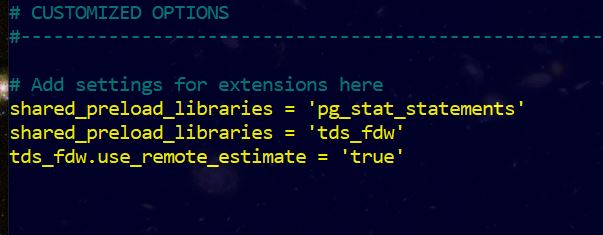
Надо именно , чтобы расширения были перечислены так: 
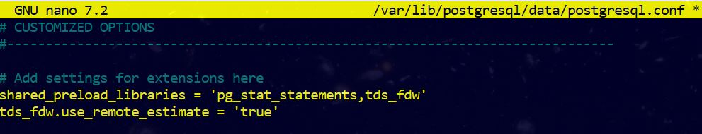

### OT_Product
```sql
psql -U postgres -d OT_Products

CREATE EXTENSION tds_fdw;
```
Подключился к базе OT_Products одного из сервисов
Создал расширение  **tds_fdw**

```sql
CREATE SERVER mssql_server
FOREIGN DATA WRAPPER tds_fdw
OPTIONS (servername 'host.docker.internal', port '1433', database 'OT_Product');
```
Создал сервер внешних данных, указывая параметры подключения к MS SQL и целевую базу OT_Product

В MS SQL в Security > Login создал пользователя ot_user  для переноса данных для всех баз сервисов
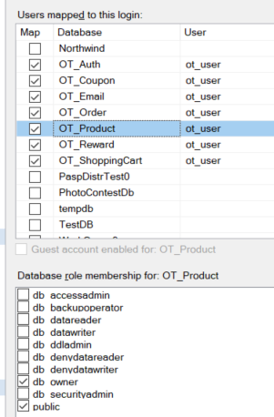

```sql
CREATE USER MAPPING FOR postgres
SERVER mssql_server
OPTIONS (username 'ot_user', password '1'); 
```
В Posgrtes cоздал пользовательское сопоставление.

###### Скрины скачивания, установки и настройки tds_fdw в Docker
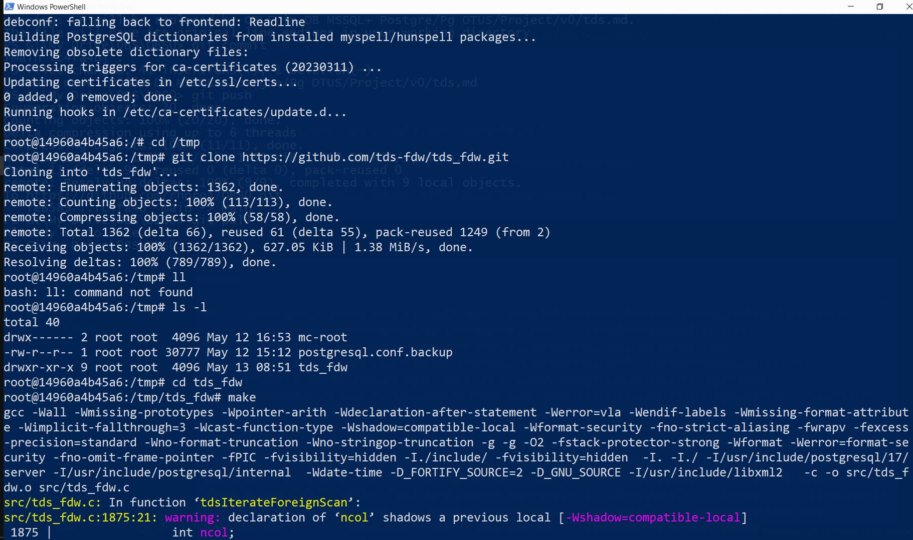
Перезагружаю контейнер, пробую создать подключиться к тестовой базе MS SQL сервера
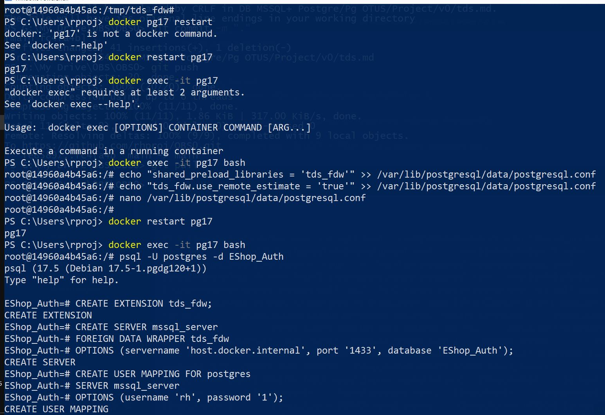


#### Создание внешних таблиц
 
```sql
CREATE SCHEMA mssql_import;
```
Создал схему для внешних таблиц, на которой далее создаю таблицы
```sql
CREATE FOREIGN TABLE mssql_import.brands (
    id uuid,
    description text,
    logo_url text,
    website text,
    country text,
    established_year integer,
    name text,
    is_active boolean,
    created_at timestamptz,
    updated_at timestamptz
) SERVER mssql_server
OPTIONS (table 'Brands');
```
Создавая таким образом, столкнулся с трудностями мапинга колонок,  они должны называться так-же как в MS SQL, по этому на получение данных из следующих колонок возвращалась ошибка
```sql
select 
logo_url 
--established_year
--is_active
--created_at
--updated_at
from mssql_import.brands limit 5;
```
ERROR: DB-Library error: DB #: 20018, DB Msg: General SQL Server error: Check messages from the SQL Server, OS #: -1, OS Msg: , Level: 16 SQL state: HV00L

NOTICE: tds_fdw: Getting results WARNING: Table definition mismatch: Foreign source has column named , but target table does not. Column will be ignored. ERROR: DB-Library error: DB #: 20018, DB Msg: General SQL Server error: Check messages from the SQL Server, OS #: -1, OS Msg: , Level: 16 SQL state: HV00L

Пересоздаю внешние таблицы с колонками не в snake_case, без нижнего подчеркивания, но в кавычках, что потребует в дальнейшем ковычить их и при запросах переноса данных, можно и не ковычить как я делал с колонками в таблицах базы OT_Auth просто тогда все колонки будут преведены к нижнему регистру.
Сами названия таблиц можн оставлять в snake_case:

Проблему с несовместимостью некоторых типов решаю просто - во внешних таблицах это будет поле text, а при вставке из внешних таблиц в целевые, буду обрабатывать текстовые данные под необходимый тип методами Regex и приведением к типу. 
Так поступаю например с данними дат, в MS SQL это ***datetimeoffset(7)***, я их буду приводить в тип ***timestamp with time zone***

**categories**
```sql
CREATE FOREIGN TABLE mssql_import.categories (
    "Id" uuid,
    "Description" text,
    "ImageUrl" text,
    "SortOrder" integer,
    "ParentCategoryId" uuid,
    "Name" text,
    "IsActive" boolean,
    "CreatedAt" text,  --создаю текстовым типом
    "UpdatedAt" text
) SERVER mssql_server
OPTIONS (
    schema_name 'dbo',
    table_name 'Categories'
);
```
**suppliers**
```sql
CREATE FOREIGN TABLE mssql_import.suppliers (
    "Id" uuid,
    "ContactPerson" text,
    "Email" text,
    "Phone" text,
    "Address" text,
    "City" text,
    "Country" text,
    "PostalCode" text,
    "CreditLimit" decimal(18,2),
    "PaymentTermsDays" integer,
    "Rating" double precision,
    "Name" text,
    "IsActive" boolean,
    "CreatedAt" text,
    "UpdatedAt" text
) SERVER mssql_server
OPTIONS (
    schema_name 'dbo',
    table_name 'Suppliers'
);
```
**tags**
```sql
CREATE FOREIGN TABLE mssql_import.tags (
    "Id" uuid,
    "Color" text,
    "UsageCount" integer,
    "Name" text,
    "IsActive" boolean,
    "CreatedAt" text,
    "UpdatedAt" text
) SERVER mssql_server
OPTIONS (
    schema_name 'dbo',
    table_name 'Tags'
);
```
**category_attributes**
```sql
CREATE FOREIGN TABLE mssql_import.category_attributes (
    "Id" uuid,
    "CategoryId" uuid,
    "AttributeType" integer,
    "IsRequired" boolean,
    "IsFilterable" boolean,
    "SortOrder" integer,
    "PossibleValues" text,
    "Unit" text,
    "Name" text,
    "IsActive" boolean,
    "CreatedAt" text,
    "UpdatedAt" text
) SERVER mssql_server
OPTIONS (
    schema_name 'dbo',
    table_name 'CategoryAttributes'
);
```
**products**
```sql
CREATE FOREIGN TABLE mssql_import.products (
    "Id" uuid,
    "ProductArticle" text,
    "Price" decimal(18,2),
    "DiscountPrice" decimal(18,2),
    "ShortDescription" text,
    "Description" text,
    "ImageUrl" text,
    "ImageLocalPath" text,
    "StockQuantity" integer,
    "MinStockLevel" integer,
    "Weight" double precision,
    "Length" double precision,
    "Width" double precision,
    "Height" double precision,
    "IsFeatured" boolean,
    "ViewCount" integer,
    "AverageRating" double precision,
    "ReviewCount" integer,
    "TotalSales" integer,
    "TotalRevenue" decimal(18,2),
    "CategoryId" uuid,
    "BrandId" uuid,
    "SupplierId" uuid,
    "Name" text,
    "IsActive" boolean,
    "CreatedAt" text,
    "UpdatedAt" text
) SERVER mssql_server
OPTIONS (
    schema_name 'dbo',
    table_name 'Products'
);
```
**product_attributes**
```sql
CREATE FOREIGN TABLE mssql_import.product_attributes (
    "Id" uuid,
    "ProductId" uuid,
    "CategoryAttributeId" uuid,
    "Value" text,
    "NumericValue" decimal(18,4),
    "BooleanValue" boolean,
    "DateValue" text,
    "Name" text,
    "IsActive" boolean,
    "CreatedAt" text,
    "UpdatedAt" text
) SERVER mssql_server
OPTIONS (
    schema_name 'dbo',
    table_name 'ProductAttributes'
);
```
**product_images**
```sql
CREATE FOREIGN TABLE mssql_import.product_images (
    "Id" uuid,
    "ProductId" uuid,
    "ImageUrl" text,
    "ImageLocalPath" text,
    "AltText" text,
    "SortOrder" integer,
    "IsPrimary" boolean,
    "FileSize" bigint,
    "FileExtension" text,
    "Name" text,
    "IsActive" boolean,
    "CreatedAt" text,
    "UpdatedAt" text
) SERVER mssql_server
OPTIONS (
    schema_name 'dbo',
    table_name 'ProductImages'
);
```
**product_price_histories**
```sql
CREATE FOREIGN TABLE mssql_import.product_price_histories (
    "Id" uuid,
    "ProductId" uuid,
    "OldPrice" decimal(18,2),
    "NewPrice" decimal(18,2),
    "OldDiscountPrice" decimal(18,2),
    "NewDiscountPrice" decimal(18,2),
    "ChangeReason" text,
    "ChangedByUserId" uuid,
    "Name" text,
    "IsActive" boolean,
    "CreatedAt" text,
    "UpdatedAt" text
) SERVER mssql_server
OPTIONS (
    schema_name 'dbo',
    table_name 'ProductPriceHistories'
);
```
**product_reviews**
```sql
CREATE FOREIGN TABLE mssql_import.product_reviews (
    "Id" uuid,
    "ProductId" uuid,
    "CustomerId" uuid,
    "Rating" integer,
    "Title" text,
    "Comment" text,
    "IsVerifiedPurchase" boolean,
    "IsApproved" boolean,
    "HelpfulCount" integer,
    "ReviewDate" text,
    "CustomerName" text,
    "Name" text,
    "IsActive" boolean,
    "CreatedAt" text,
    "UpdatedAt" text
) SERVER mssql_server
OPTIONS (
    schema_name 'dbo',
    table_name 'ProductReviews'
);
```
**product_tags**
```sql
ProductTags
CREATE FOREIGN TABLE mssql_import.product_tags (
    "ProductId" uuid,
    "TagId" uuid,
    "AssignedAt" text
) SERVER mssql_server
OPTIONS (
    schema_name 'dbo',
    table_name 'ProductTags'
);
```
**product_view_history**
```sql
CREATE FOREIGN TABLE mssql_import.product_view_history (
    "Id" uuid,
    "ProductId" uuid,
    "CustomerId" uuid,
    "ViewedAt" text,
    "IpAddress" text,
    "UserAgent" text,
    "Referrer" text,
    "SessionDurationSeconds" integer,
    "Name" text,
    "IsActive" boolean,
    "CreatedAt" text,
    "UpdatedAt" text
) SERVER mssql_server
OPTIONS (
    schema_name 'dbo',
    table_name 'ProductViewHistory'
);
```
Итого создано 12 внешних таблиц Foreign Table для базы **Product**

Для удобства редактирования скриптов продолжаю работать в pgAdmin
Скрин с Foreign Data Wrapper - 
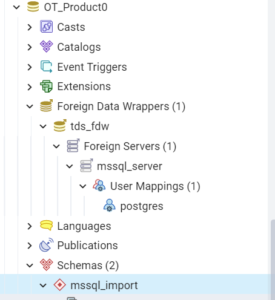

Созданные внешние таблицы:

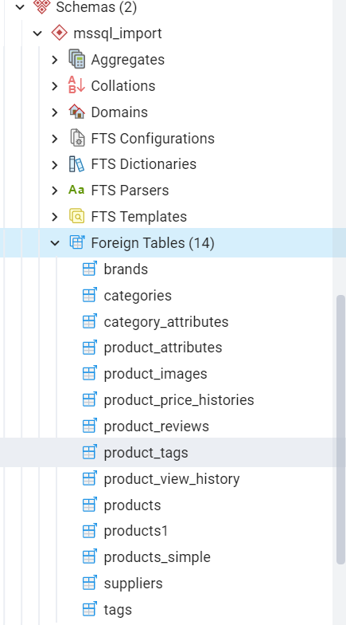

Смотрю что колличество данных в foreign table соответствует таблицам MS SQL
```sql
SELECT 'brands' as table_name, COUNT(*) as record_count FROM mssql_import.brands
UNION ALL
SELECT 'categories', COUNT(*) FROM mssql_import.categories
UNION ALL
SELECT 'suppliers', COUNT(*) FROM mssql_import.suppliers
UNION ALL
SELECT 'tags', COUNT(*) FROM mssql_import.tags
UNION ALL
SELECT 'category_attributes', COUNT(*) FROM mssql_import.category_attributes
UNION ALL
SELECT 'products', COUNT(*) FROM mssql_import.products
UNION ALL
SELECT 'product_attributes', COUNT(*) FROM mssql_import.product_attributes
UNION ALL
SELECT 'product_images', COUNT(*) FROM mssql_import.product_images
UNION ALL
SELECT 'product_price_histories', COUNT(*) FROM mssql_import.product_price_histories
UNION ALL
SELECT 'product_reviews', COUNT(*) FROM mssql_import.product_reviews
UNION ALL
SELECT 'product_tags', COUNT(*) FROM mssql_import.product_tags
UNION ALL
SELECT 'product_view_history', COUNT(*) FROM mssql_import.product_view_history
ORDER BY table_name;
```

#### Миграция данных
Начинаю перенос данных в таблицах в порядке наростания зависимоти, 

Сложно-приводимые типы как упомянал выже, перевожу из  текстовых данных  с использованием Regex и приведением к типу. 
Так поступаю например с данними дат, в MS SQL это ***datetimeoffset(7)***, я их буду приводить в тип ***timestamp with time zone***

Переношу данные из foreign-table внешних таблиц в целевые:
###### brands
```sql
INSERT INTO public.brands (
    id, description, logo_url, website, country, established_year, "name", is_active, created_at, updated_at
)
SELECT 
    "Id",
    "Description",
    "LogoUrl",
    "Website",
    "Country",
    "EstablishedYear",
    "Name",
    "IsActive",
    TO_TIMESTAMP(
        REGEXP_REPLACE(
            REGEXP_REPLACE("CreatedAt", ':\d+[AP]M$', ''),
            ':\d{7}$', ''
        ),
        'Mon DD YYYY HH:MI:SS'
    )::timestamptz,
    CASE WHEN "UpdatedAt" IS NOT NULL AND "UpdatedAt" != '' 
         THEN TO_TIMESTAMP(
            REGEXP_REPLACE(
                REGEXP_REPLACE("UpdatedAt", ':\d+[AP]M$', ''),
                ':\d{7}$', ''
            ),
            'Mon DD YYYY HH:MI:SS'
        )::timestamptz
         ELSE NULL END
FROM mssql_import.brands
ON CONFLICT (id) DO UPDATE SET
    description = EXCLUDED.description,
    logo_url = EXCLUDED.logo_url,
    website = EXCLUDED.website,
    country = EXCLUDED.country,
    established_year = EXCLUDED.established_year,
    "name" = EXCLUDED."name",
    is_active = EXCLUDED.is_active,
    updated_at = EXCLUDED.updated_at;
```
###### tags
```sql
INSERT INTO public.tags (id, color, usage_count, "name", is_active, created_at, updated_at)
SELECT 
    "Id",
    "Color",
    "UsageCount",
    "Name",
    "IsActive",
	    TO_TIMESTAMP(
        REGEXP_REPLACE(
            REGEXP_REPLACE("CreatedAt", ':\d+[AP]M$', ''),
            ':\d{7}$', ''
        ),
        'Mon DD YYYY HH:MI:SS'
    )::timestamptz,
    CASE WHEN "UpdatedAt" IS NOT NULL AND "UpdatedAt" != '' 
         THEN TO_TIMESTAMP(
            REGEXP_REPLACE(
                REGEXP_REPLACE("UpdatedAt", ':\d+[AP]M$', ''),
                ':\d{7}$', ''
            ),
            'Mon DD YYYY HH:MI:SS'
        )::timestamptz
         ELSE NULL END
FROM mssql_import.tags
ON CONFLICT (id) DO UPDATE SET
    color = EXCLUDED.color,
    usage_count = EXCLUDED.usage_count,
    "name" = EXCLUDED."name",
    is_active = EXCLUDED.is_active,
    updated_at = EXCLUDED.updated_at;
```

###### suppliers
```sql
INSERT INTO public.suppliers (
    id, contact_person, email, phone, address, city, country, postal_code,
    credit_limit, payment_terms_days, rating, "name", is_active, created_at, updated_at
)
SELECT 
    "Id",
    "ContactPerson",
    "Email",
    "Phone",
    "Address",
    "City",
    "Country",
    "PostalCode",
    "CreditLimit",
    "PaymentTermsDays",
    "Rating",
    "Name",
    "IsActive",
    TO_TIMESTAMP(
        REGEXP_REPLACE(
            REGEXP_REPLACE("CreatedAt", ':\d+[AP]M$', ''),
            ':\d{7}$', ''
        ),
        'Mon DD YYYY HH:MI:SS'
    )::timestamptz,
    CASE WHEN "UpdatedAt" IS NOT NULL AND "UpdatedAt" != '' 
         THEN TO_TIMESTAMP(
            REGEXP_REPLACE(
                REGEXP_REPLACE("UpdatedAt", ':\d+[AP]M$', ''),
                ':\d{7}$', ''
            ),
            'Mon DD YYYY HH:MI:SS'
        )::timestamptz
         ELSE NULL END
FROM mssql_import.suppliers
ON CONFLICT (id) DO UPDATE SET
    contact_person = EXCLUDED.contact_person,
    email = EXCLUDED.email,
    phone = EXCLUDED.phone,
    address = EXCLUDED.address,
    city = EXCLUDED.city,
    country = EXCLUDED.country,
    postal_code = EXCLUDED.postal_code,
    credit_limit = EXCLUDED.credit_limit,
    payment_terms_days = EXCLUDED.payment_terms_days,
    rating = EXCLUDED.rating,
    "name" = EXCLUDED."name",
    is_active = EXCLUDED.is_active,
    updated_at = EXCLUDED.updated_at;
```

```sql
SELECT (
		(SELECT COUNT(*) FROM mssql_import.suppliers) - 
		(SELECT COUNT(*) FROM public.suppliers)
	   )
```
Проверяю колличество записей
###### categories
Перенос таблиц с самоссылающимеся колонками
Переношу сначало записи без связей (родительские)
```sql
INSERT INTO public.categories (
    id, description, image_url, sort_order, parent_category_id,
    "name", is_active, created_at, updated_at
)
SELECT 
    "Id",
    "Description",
    "ImageUrl",
    "SortOrder",
    "ParentCategoryId",
    "Name",
    "IsActive",
    TO_TIMESTAMP(
        REGEXP_REPLACE(
            REGEXP_REPLACE("CreatedAt", ':\d+[AP]M$', ''),
            ':\d{7}$', ''
        ),
        'Mon DD YYYY HH:MI:SS'
    )::timestamptz,
    CASE WHEN "UpdatedAt" IS NOT NULL AND "UpdatedAt" != '' 
         THEN TO_TIMESTAMP(
            REGEXP_REPLACE(
                REGEXP_REPLACE("UpdatedAt", ':\d+[AP]M$', ''),
                ':\d{7}$', ''
            ),
            'Mon DD YYYY HH:MI:SS'
        )::timestamptz
         ELSE NULL END
FROM mssql_import.categories
WHERE "ParentCategoryId" IS NULL
ON CONFLICT (id) DO UPDATE SET
    description = EXCLUDED.description,
    image_url = EXCLUDED.image_url,
    sort_order = EXCLUDED.sort_order,
    parent_category_id = EXCLUDED.parent_category_id,
    "name" = EXCLUDED."name",
    is_active = EXCLUDED.is_active,
    updated_at = EXCLUDED.updated_at;
```
После переношу дочерние категории с ссылками
```sql
INSERT INTO public.categories (
    id, description, image_url, sort_order, parent_category_id,
    "name", is_active, created_at, updated_at
)
SELECT 
    "Id",
    "Description",
    "ImageUrl",
    "SortOrder",
    "ParentCategoryId",
    "Name",
    "IsActive",
    TO_TIMESTAMP(
        REGEXP_REPLACE(
            REGEXP_REPLACE("CreatedAt", ':\d+[AP]M$', ''),
            ':\d{7}$', ''
        ),
        'Mon DD YYYY HH:MI:SS'
    )::timestamptz,
    CASE WHEN "UpdatedAt" IS NOT NULL AND "UpdatedAt" != '' 
         THEN TO_TIMESTAMP(
            REGEXP_REPLACE(
                REGEXP_REPLACE("UpdatedAt", ':\d+[AP]M$', ''),
                ':\d{7}$', ''
            ),
            'Mon DD YYYY HH:MI:SS'
        )::timestamptz
         ELSE NULL END
FROM mssql_import.categories
WHERE "ParentCategoryId" IS NOT NULL
ON CONFLICT (id) DO UPDATE SET
    description = EXCLUDED.description,
    image_url = EXCLUDED.image_url,
    sort_order = EXCLUDED.sort_order,
    parent_category_id = EXCLUDED.parent_category_id,
    "name" = EXCLUDED."name",
    is_active = EXCLUDED.is_active,
    updated_at = EXCLUDED.updated_at;
```

###### category_attributes
Теперь переношу данные, с зависимостями
```sql
INSERT INTO public.category_attributes (
    id, category_id, attribute_type, is_required, is_filterable, sort_order,
    possible_values, unit, "name", is_active, created_at, updated_at
)
SELECT 
    "Id",
    "CategoryId",
    "AttributeType",
    "IsRequired",
    "IsFilterable",
    "SortOrder",
    "PossibleValues",
    "Unit",
    "Name",
    "IsActive",
    TO_TIMESTAMP(
        REGEXP_REPLACE(
            REGEXP_REPLACE("CreatedAt", ':\d+[AP]M$', ''),
            ':\d{7}$', ''
        ),
        'Mon DD YYYY HH:MI:SS'
    )::timestamptz,
    CASE WHEN "UpdatedAt" IS NOT NULL AND "UpdatedAt" != '' 
         THEN TO_TIMESTAMP(
            REGEXP_REPLACE(
                REGEXP_REPLACE("UpdatedAt", ':\d+[AP]M$', ''),
                ':\d{7}$', ''
            ),
            'Mon DD YYYY HH:MI:SS'
        )::timestamptz
         ELSE NULL END
FROM mssql_import.category_attributes
ON CONFLICT (id) DO UPDATE SET
    category_id = EXCLUDED.category_id,
    attribute_type = EXCLUDED.attribute_type,
    is_required = EXCLUDED.is_required,
    is_filterable = EXCLUDED.is_filterable,
    sort_order = EXCLUDED.sort_order,
    possible_values = EXCLUDED.possible_values,
    unit = EXCLUDED.unit,
    "name" = EXCLUDED."name",
    is_active = EXCLUDED.is_active,
    updated_at = EXCLUDED.updated_at;
```

###### product_attributes
```sql
INSERT INTO public.product_attributes(
	     id, product_id, category_attribute_id, value, numeric_value, boolean_value, date_value, name, is_active, created_at, updated_at)
SELECT "Id", "ProductId", "CategoryAttributeId", "Value", "NumericValue", "BooleanValue", 

    CASE WHEN "DateValue" IS NOT NULL AND "DateValue" != '' 
         THEN TO_TIMESTAMP(
            REGEXP_REPLACE(
                REGEXP_REPLACE("DateValue", ':\d+[AP]M$', ''),
                ':\d{7}$', ''
            ),
            'Mon DD YYYY HH:MI:SS'
        )::timestamptz
         ELSE NULL END,
	"Name", "IsActive",
    TO_TIMESTAMP(
        REGEXP_REPLACE(
            REGEXP_REPLACE("CreatedAt", ':\d+[AP]M$', ''),
            ':\d{7}$', ''
        ),
        'Mon DD YYYY HH:MI:SS'
    )::timestamptz,
    CASE WHEN "UpdatedAt" IS NOT NULL AND "UpdatedAt" != '' 
         THEN TO_TIMESTAMP(
            REGEXP_REPLACE(
                REGEXP_REPLACE("UpdatedAt", ':\d+[AP]M$', ''),
                ':\d{7}$', ''
            ),
            'Mon DD YYYY HH:MI:SS'
        )::timestamptz
         ELSE NULL END
		 
	FROM mssql_import.product_attributes
	ON CONFLICT (id) DO UPDATE SET
    product_id = EXCLUDED.product_id,
    category_attribute_id = EXCLUDED.category_attribute_id,
    value = EXCLUDED.value,
    numeric_value = EXCLUDED.numeric_value,
    boolean_value = EXCLUDED.boolean_value,
    date_value = EXCLUDED.date_value,
    name = EXCLUDED.name,
    is_active = EXCLUDED.is_active,
    updated_at = EXCLUDED.updated_at;
```
###### products миграция в цикле  (200,000 записей) 
```sql
SELECT 
	"Id", "ProductArticle", "Price", "DiscountPrice",
	CASE 
	    WHEN "Price" > 0 AND "DiscountPrice" IS NOT NULL 
	    THEN (("Price" - "DiscountPrice") / "Price" * 100)::decimal(10,2)
	    ELSE NULL 
	END, ...
```
Legacy логика хранения окончательной цены

```sql
explain analyze  SELECT 
            "Id", "ProductArticle", "Price", "DiscountPrice",
            "ShortDescription", "Description", "ImageUrl", "ImageLocalPath",
            "StockQuantity", "MinStockLevel", "Weight", "Length", "Width", "Height",
            "IsFeatured", "ViewCount", "AverageRating", "ReviewCount", 
            "TotalSales", "TotalRevenue", "CategoryId", "BrandId", "SupplierId", "Name", "IsActive",
            TO_TIMESTAMP(
                REGEXP_REPLACE(
                    REGEXP_REPLACE("CreatedAt", ':\d+[AP]M$', ''),
                    ':\d{7}$', ''
                ),
                'Mon DD YYYY HH:MI:SS'
            )::timestamptz,
            CASE WHEN "UpdatedAt" IS NOT NULL AND "UpdatedAt" != '' 
                 THEN TO_TIMESTAMP(
                    REGEXP_REPLACE(
                        REGEXP_REPLACE("UpdatedAt", ':\d+[AP]M$', ''),
                        ':\d{7}$', ''
                    ),
                    'Mon DD YYYY HH:MI:SS'
                )::timestamptz
                 ELSE NULL END
        FROM mssql_import.products limit 100 
```
"Limit  (cost=200.00..10202.70 rows=100 width=394) (actual time=41.769..69.366 rows=100 loops=1)"
"  ->  Foreign Scan on products  (cost=200.00..20005600.00 rows=200000 width=394) (actual time=41.767..69.334 rows=100 loops=1)"
"Planning Time: 40243.783 ms"
"Execution Time: 84.219 ms"

Слишком долгая загрузка на прямую, 
пробую Альтернативный подход: сначала загружаю во временную таблицу с текстовыми датами, потом из неё перенесу в целевую, таким образом разделяя нагрузку
```sql
-- Временную таблицу для быстрой загрузки
CREATE TEMP TABLE temp_products AS
SELECT 
    "Id", "ProductArticle", "Price", "DiscountPrice",
    "ShortDescription", "Description", "ImageUrl", "ImageLocalPath",
    "StockQuantity", "MinStockLevel", "Weight", "Length", "Width", "Height",
    "IsFeatured", "ViewCount", "AverageRating", "ReviewCount", 
    "TotalSales", "TotalRevenue", "CategoryId", "BrandId", "SupplierId", 
    "Name", "IsActive", "CreatedAt", "UpdatedAt"
FROM mssql_import.products_simple
LIMIT 0; -- Cтруктура без данных

DO $$
DECLARE
    batch_size INTEGER := 5000;
    current_offset INTEGER := 0;
    processed_count INTEGER := 0;
    total_count INTEGER;
BEGIN
    SELECT COUNT(*) INTO total_count FROM mssql_import.products_simple;
    RAISE NOTICE 'Loading raw data: % records', total_count;
    
    LOOP
        INSERT INTO temp_products
        SELECT 
            "Id", "ProductArticle", "Price", "DiscountPrice",
            "ShortDescription", "Description", "ImageUrl", "ImageLocalPath",
            "StockQuantity", "MinStockLevel", "Weight", "Length", "Width", "Height",
            "IsFeatured", "ViewCount", "AverageRating", "ReviewCount", 
            "TotalSales", "TotalRevenue", "CategoryId", "BrandId", "SupplierId", 
            "Name", "IsActive", "CreatedAt", "UpdatedAt"
        FROM mssql_import.products_simple
        ORDER BY "Id"
        LIMIT batch_size OFFSET current_offset;
        
        GET DIAGNOSTICS processed_count = ROW_COUNT;
        EXIT WHEN processed_count = 0;
        
        current_offset := current_offset + batch_size;
        RAISE NOTICE 'Loaded: %/%', current_offset, total_count;
        
        PERFORM pg_sleep(0.02);
    END LOOP;
END $$;

--Вставляю в основную таблицу с преобразованиями
INSERT INTO public.products (
    id, product_article, price, discount_price, 
    short_description, description, image_url, image_local_path, 
    stock_quantity, min_stock_level, weight, length, width, height, 
    is_featured, view_count, average_rating, review_count, total_sales, 
    total_revenue, category_id, brand_id, supplier_id, "name", 
    is_active, created_at, updated_at
)
SELECT 
    "Id", "ProductArticle", "Price", "DiscountPrice",
    "ShortDescription", "Description", "ImageUrl", "ImageLocalPath",
    "StockQuantity", "MinStockLevel", "Weight", "Length", "Width", "Height",
    "IsFeatured", "ViewCount", "AverageRating", "ReviewCount", 
    "TotalSales", "TotalRevenue", "CategoryId", "BrandId", "SupplierId", 
    "Name", "IsActive",
    -- Преобразование даты локально в PostgreSQL
    TO_TIMESTAMP(
        REGEXP_REPLACE(
            REGEXP_REPLACE("CreatedAt", ':\d+[AP]M$', ''),
            ':\d{7}$', ''
        ),
        'Mon DD YYYY HH:MI:SS'
    )::timestamptz,
    CASE WHEN "UpdatedAt" IS NOT NULL AND "UpdatedAt" != '' 
         THEN TO_TIMESTAMP(
            REGEXP_REPLACE(
                REGEXP_REPLACE("UpdatedAt", ':\d+[AP]M$', ''),
                ':\d{7}$', ''
            ),
            'Mon DD YYYY HH:MI:SS'
        )::timestamptz
         ELSE NULL END
FROM temp_products
ON CONFLICT (id) DO UPDATE SET
    product_article = EXCLUDED.product_article,
    price = EXCLUDED.price,
    discount_price = EXCLUDED.discount_price,
    updated_at = EXCLUDED.updated_at;

SELECT 'Products migrated via temp table: ' || COUNT(*) as result FROM public.products;
```
```shell
NOTICE:  tds_fdw: Query executed correctly
NOTICE:  tds_fdw: Getting results
WARNING:  Table definition mismatch: Foreign source has column named , but target table does not. Column will be ignored.
NOTICE:  Loading raw data: 200000 records
....
NOTICE:  Loaded: 185000/200000
NOTICE:  Loaded: 190000/200000
NOTICE:  Loaded: 195000/200000
NOTICE:  Loaded: 200000/200000
```

**Перенос из временной таблицы**
```sql


INSERT INTO public.products (
    id, product_article, price, discount_price, 
    short_description, description, image_url, image_local_path, 
    stock_quantity, min_stock_level, weight, length, width, height, 
    is_featured, view_count, average_rating, review_count, total_sales, 
    total_revenue, category_id, brand_id, supplier_id, "name", 
    is_active, created_at, updated_at
)
SELECT 
    "Id", 
    "ProductArticle", 
    "Price", 
    "DiscountPrice",
    "ShortDescription", 
    "Description", 
    "ImageUrl", 
    "ImageLocalPath",
    "StockQuantity", 
    "MinStockLevel", 
    "Weight", 
    "Length", 
    "Width", 
    "Height",
    "IsFeatured", 
    "ViewCount", 
    "AverageRating", 
    "ReviewCount", 
    "TotalSales", 
    "TotalRevenue", 
    "CategoryId", 
    "BrandId", 
    "SupplierId", 
    "Name", 
    "IsActive",

    TO_TIMESTAMP(
        REGEXP_REPLACE(
            REGEXP_REPLACE("CreatedAt", ':\d+[AP]M$', ''),
            ':\d{7}$', ''
        ),
        'Mon DD YYYY HH:MI:SS'
    )::timestamptz,
    CASE WHEN "UpdatedAt" IS NOT NULL AND "UpdatedAt" != '' 
         THEN TO_TIMESTAMP(
            REGEXP_REPLACE(
                REGEXP_REPLACE("UpdatedAt", ':\d+[AP]M$', ''),
                ':\d{7}$', ''
            ),
            'Mon DD YYYY HH:MI:SS'
        )::timestamptz
         ELSE NULL END
FROM temp_products
ON CONFLICT (id) DO UPDATE SET
    product_article = EXCLUDED.product_article,
    price = EXCLUDED.price,
    discount_price = EXCLUDED.discount_price,
    updated_at = EXCLUDED.updated_at;


```
INSERT 0 200000 Query returned successfully in 1 min 2 secs.

Т.е что сделал - загрузили поля, требующие приведения как есть в текстовом виде во временные таблицы, а потом их перенес из временных таблиц приводя к нужному типу в целевые таблицы.  

###### product_price_histories
```sql
-- Миграция ProductPriceHistories (150,000 записей)
-- Переносим батчами по 5,000 записей
DO $$
DECLARE
    batch_size INTEGER := 5000;
    offset_val INTEGER := 0;
    rows_affected INTEGER;
    total_migrated INTEGER := 0;
BEGIN
    RAISE NOTICE 'Начинаем миграцию ProductPriceHistories...';
    
    LOOP
        INSERT INTO public.product_price_histories (
            id, product_id, old_price, new_price, old_discount_price, 
            new_discount_price, change_reason, changed_by_user_id, 
            name, is_active, created_at, updated_at
        )
        SELECT 
            "Id",
            "ProductId",
            "OldPrice",
            "NewPrice",
            "OldDiscountPrice",
            "NewDiscountPrice",
            "ChangeReason",
            "ChangedByUserId",
            "Name",
            "IsActive",
            TO_TIMESTAMP(
                REGEXP_REPLACE(
                    REGEXP_REPLACE("CreatedAt", ':\d+[AP]M$', ''),
                    ':\d{7}$', ''
                ),
                'Mon DD YYYY HH:MI:SS'
            )::timestamptz,
            CASE WHEN "UpdatedAt" IS NOT NULL AND "UpdatedAt" != '' 
                 THEN TO_TIMESTAMP(
                    REGEXP_REPLACE(
                        REGEXP_REPLACE("UpdatedAt", ':\d+[AP]M$', ''),
                        ':\d{7}$', ''
                    ),
                    'Mon DD YYYY HH:MI:SS'
                )::timestamptz
                 ELSE NULL END
        FROM mssql_import.product_price_histories
        ORDER BY "Id"
        LIMIT batch_size OFFSET offset_val
        ON CONFLICT (id) DO UPDATE SET
            product_id = EXCLUDED.product_id,
            old_price = EXCLUDED.old_price,
            new_price = EXCLUDED.new_price,
            old_discount_price = EXCLUDED.old_discount_price,
            new_discount_price = EXCLUDED.new_discount_price,
            change_reason = EXCLUDED.change_reason,
            changed_by_user_id = EXCLUDED.changed_by_user_id,
            name = EXCLUDED.name,
            is_active = EXCLUDED.is_active,
            updated_at = EXCLUDED.updated_at;
        
        GET DIAGNOSTICS rows_affected = ROW_COUNT;
        total_migrated := total_migrated + rows_affected;
        
        RAISE NOTICE 'ProductPriceHistories: обработано % записей, всего мигрировано: %', 
                     rows_affected, total_migrated;
        
        IF rows_affected < batch_size THEN
            EXIT;
        END IF;
        
        offset_val := offset_val + batch_size;
        PERFORM pg_sleep(0.1);
    END LOOP;
    
    RAISE NOTICE 'Миграция ProductPriceHistories завершена. Всего мигрировано: % записей', total_migrated;
END $$;
```

```sql
NOTICE:  Начинаем миграцию ProductPriceHistories...
NOTICE:  tds_fdw: Query executed correctly
NOTICE:  tds_fdw: Getting results
NOTICE:  tds_fdw: Query executed correctly
NOTICE:  tds_fdw: Getting results
NOTICE:  ProductPriceHistories: обработано 5000 записей, всего мигрировано: 5000
...
NOTICE:  ProductPriceHistories: обработано 5000 записей, всего мигрировано: 145000
NOTICE:  ProductPriceHistories: обработано 5000 записей, всего мигрировано: 150000
NOTICE:  ProductPriceHistories: обработано 0 записей, всего мигрировано: 150000
NOTICE:  Миграция ProductPriceHistories завершена. Всего мигрировано: 150000 записей
DO

Query returned successfully in 1 min 37 secs.
Total rows: 100 of 100
Query complete 00:01:37.220
Ln 77, Col 1
```

###### product_tags
```sql
DO $$
DECLARE
    batch_size INTEGER := 10000;
    offset_val INTEGER := 0;
    rows_affected INTEGER;
    total_migrated INTEGER := 0;
BEGIN
    RAISE NOTICE 'Начинаем миграцию ProductTags...';
    
    LOOP
        INSERT INTO public.product_tags (
            product_id, tag_id, assigned_at
        )
        SELECT 
            "ProductId",
            "TagId",
            TO_TIMESTAMP(
                REGEXP_REPLACE(
                    REGEXP_REPLACE("AssignedAt", ':\d+[AP]M$', ''),
                    ':\d{7}$', ''
                ),
                'Mon DD YYYY HH:MI:SS'
            )::timestamptz
        FROM mssql_import.product_tags
        ORDER BY "ProductId", "TagId"
        LIMIT batch_size OFFSET offset_val
        ON CONFLICT (product_id, tag_id) DO UPDATE SET
            assigned_at = EXCLUDED.assigned_at;
        
        GET DIAGNOSTICS rows_affected = ROW_COUNT;
        total_migrated := total_migrated + rows_affected;
        
        RAISE NOTICE 'ProductTags: обработано % записей, всего мигрировано: %', 
                     rows_affected, total_migrated;
        
        IF rows_affected < batch_size THEN
            EXIT;
        END IF;
        
        offset_val := offset_val + batch_size;
        PERFORM pg_sleep(0.1);
    END LOOP;
    
    RAISE NOTICE 'Миграция ProductTags завершена. Всего мигрировано: % записей', total_migrated;
END $$;

```

```shell
NOTICE:  Начинаем миграцию ProductTags...
NOTICE:  tds_fdw: Query executed correctly
NOTICE:  tds_fdw: Getting results
NOTICE:  tds_fdw: Query executed correctly
NOTICE:  tds_fdw: Getting results
NOTICE:  ProductTags: обработано 10000 записей, всего мигрировано: 10000
NOTICE:  tds_fdw: Query executed correctly
...
NOTICE:  ProductTags: обработано 10000 записей, всего мигрировано: 200000
NOTICE:  ProductTags: обработано 10000 записей, всего мигрировано: 210000
NOTICE:  ProductTags: обработано 0 записей, всего мигрировано: 210000
NOTICE:  Миграция ProductTags завершена. Всего мигрировано: 210000 записей
DO

Query returned successfully in 41 secs 406 msec.
Total rows: 100 of 100
Query complete 00:00:41.406
Ln 49, Col 1
```

###### product_images
```sql
DO $$
DECLARE
    batch_size INTEGER := 5000;
    offset_val INTEGER := 0;
    rows_affected INTEGER;
    total_migrated INTEGER := 0;
BEGIN
    RAISE NOTICE 'Начинаем миграцию ProductImages...';
    
    LOOP
        INSERT INTO public.product_images (
            id, product_id, image_url, image_local_path, alt_text, 
            sort_order, is_primary, file_size, width, height, 
            file_extension, name, is_active, created_at, updated_at
        )
        SELECT 
            "Id",
            "ProductId",
            "ImageUrl",
            "ImageLocalPath",
            "AltText",
            "SortOrder",
            "IsPrimary",
            "FileSize",
            "FileExtension",
            "Name",
            "IsActive",
            TO_TIMESTAMP(
                REGEXP_REPLACE(
                    REGEXP_REPLACE("CreatedAt", ':\d+[AP]M$', ''),
                    ':\d{7}$', ''
                ),
                'Mon DD YYYY HH:MI:SS'
            )::timestamptz,
            CASE WHEN "UpdatedAt" IS NOT NULL AND "UpdatedAt" != '' 
                 THEN TO_TIMESTAMP(
                    REGEXP_REPLACE(
                        REGEXP_REPLACE("UpdatedAt", ':\d+[AP]M$', ''),
                        ':\d{7}$', ''
                    ),
                    'Mon DD YYYY HH:MI:SS'
                )::timestamptz
                 ELSE NULL END
        FROM mssql_import.product_images
        ORDER BY "Id"
        LIMIT batch_size OFFSET offset_val
        ON CONFLICT (id) DO UPDATE SET
            product_id = EXCLUDED.product_id,
            image_url = EXCLUDED.image_url,
            image_local_path = EXCLUDED.image_local_path,
            alt_text = EXCLUDED.alt_text,
            sort_order = EXCLUDED.sort_order,
            is_primary = EXCLUDED.is_primary,
            file_size = EXCLUDED.file_size,
            file_extension = EXCLUDED.file_extension,
            name = EXCLUDED.name,
            is_active = EXCLUDED.is_active,
            updated_at = EXCLUDED.updated_at;
        
        GET DIAGNOSTICS rows_affected = ROW_COUNT;
        total_migrated := total_migrated + rows_affected;
        
        RAISE NOTICE 'ProductImages: обработано % записей, всего мигрировано: %', 
                     rows_affected, total_migrated;
        
        IF rows_affected < batch_size THEN
            EXIT;
        END IF;
        
        offset_val := offset_val + batch_size;
        PERFORM pg_sleep(0.1);
    END LOOP;
    
    RAISE NOTICE 'Миграция ProductImages завершена. Всего мигрировано: % записей', total_migrated;
END $$;

```

```shell
NOTICE:  Начинаем миграцию ProductImages...
NOTICE:  tds_fdw: Query executed correctly
NOTICE:  tds_fdw: Getting results
NOTICE:  tds_fdw: Query executed correctly
NOTICE:  tds_fdw: Getting results
NOTICE:  ProductImages: обработано 5000 записей, всего мигрировано: 5000
NOTICE:  tds_fdw: Query executed correctly
NOTICE:  tds_fdw: Getting results
NOTICE:  tds_fdw: Query executed correctly
NOTICE:  tds_fdw: Getting results
...
NOTICE:  ProductImages: обработано 5000 записей, всего мигрировано: 290000
NOTICE:  ProductImages: обработано 5000 записей, всего мигрировано: 295000
NOTICE:  ProductImages: обработано 5000 записей, всего мигрировано: 300000
NOTICE:  ProductImages: обработано 0 записей, всего мигрировано: 300000
NOTICE:  Миграция ProductImages завершена. Всего мигрировано: 300000 записей
DO

Query returned successfully in 12 min 23 secs.
Total rows: 100 of 100
Query complete 00:12:23.929
Ln 82, Col 1
```

###### product_reviews
```sql
-- Миграция ProductReviews (500,000 записей)
-- Переносим батчами по 5,000 записей

DO $$
DECLARE
    batch_size INTEGER := 5000;
    offset_val INTEGER := 0;
    rows_affected INTEGER;
    total_migrated INTEGER := 0;
BEGIN
    RAISE NOTICE 'Начинаем миграцию ProductReviews...';
    
    LOOP
        INSERT INTO public.product_reviews (
            id, product_id, customer_id, rating, title, comment, 
            is_verified_purchase, is_approved, helpful_count, 
            review_date, customer_name, name, is_active, created_at, updated_at
        )
        SELECT 
            "Id",
            "ProductId",
            "CustomerId",
            "Rating",
            "Title",
            "Comment",
            "IsVerifiedPurchase",
            "IsApproved",
            "HelpfulCount",
            TO_TIMESTAMP(
                REGEXP_REPLACE(
                    REGEXP_REPLACE("ReviewDate", ':\d+[AP]M$', ''),
                    ':\d{7}$', ''
                ),
                'Mon DD YYYY HH:MI:SS'
            )::timestamptz,
            "CustomerName",
            "Name",
            "IsActive",
            TO_TIMESTAMP(
                REGEXP_REPLACE(
                    REGEXP_REPLACE("CreatedAt", ':\d+[AP]M$', ''),
                    ':\d{7}$', ''
                ),
                'Mon DD YYYY HH:MI:SS'
            )::timestamptz,
            CASE WHEN "UpdatedAt" IS NOT NULL AND "UpdatedAt" != '' 
                 THEN TO_TIMESTAMP(
                    REGEXP_REPLACE(
                        REGEXP_REPLACE("UpdatedAt", ':\d+[AP]M$', ''),
                        ':\d{7}$', ''
                    ),
                    'Mon DD YYYY HH:MI:SS'
                )::timestamptz
                 ELSE NULL END
        FROM mssql_import.product_reviews
        ORDER BY "Id"
        LIMIT batch_size OFFSET offset_val
        ON CONFLICT (id) DO UPDATE SET
            product_id = EXCLUDED.product_id,
            customer_id = EXCLUDED.customer_id,
            rating = EXCLUDED.rating,
            title = EXCLUDED.title,
            comment = EXCLUDED.comment,
            is_verified_purchase = EXCLUDED.is_verified_purchase,
            is_approved = EXCLUDED.is_approved,
            helpful_count = EXCLUDED.helpful_count,
            review_date = EXCLUDED.review_date,
            customer_name = EXCLUDED.customer_name,
            name = EXCLUDED.name,
            is_active = EXCLUDED.is_active,
            updated_at = EXCLUDED.updated_at;
        
        GET DIAGNOSTICS rows_affected = ROW_COUNT;
        total_migrated := total_migrated + rows_affected;
        
        RAISE NOTICE 'ProductReviews: обработано % записей, всего мигрировано: %', 
                     rows_affected, total_migrated;
        
        IF rows_affected < batch_size THEN
            EXIT;
        END IF;
        
        offset_val := offset_val + batch_size;
        PERFORM pg_sleep(0.1);
    END LOOP;
    
    RAISE NOTICE 'Миграция ProductReviews завершена. Всего мигрировано: % записей', total_migrated;
END $$;

```

```sql
NOTICE:  Начинаем миграцию ProductReviews...
NOTICE:  tds_fdw: Query executed correctly
NOTICE:  tds_fdw: Getting results
NOTICE:  tds_fdw: Query executed correctly
NOTICE:  tds_fdw: Getting results
NOTICE:  ProductReviews: обработано 5000 записей, всего мигрировано: 5000
NOTICE:  tds_fdw: Query executed correctly
....

NOTICE:  ProductReviews: обработано 5000 записей, всего мигрировано: 495000
NOTICE:  ProductReviews: обработано 5000 записей, всего мигрировано: 500000
NOTICE:  ProductReviews: обработано 0 записей, всего мигрировано: 500000
NOTICE:  Миграция ProductReviews завершена. Всего мигрировано: 500000 записей
DO

Query returned successfully in 1 hr 9 min.
```

###### product_view_histories  
Самая большая таблица по колличеству записей
1,000,000 записей,  переношу батчами по 2,000 записей
```sql
DO $$
DECLARE
    batch_size INT := 2000;
    offset_val INT := 0;
    rows_affected INT;
    total_migrated INT := 0;
BEGIN
    RAISE NOTICE 'Миграция ProductViewHistory';
    
    LOOP
        INSERT INTO public.product_view_histories (
            id, product_id, customer_id, viewed_at, ip_address, 
            user_agent, referrer, view_duration_seconds, 
            name, is_active, created_at, updated_at
        )
        SELECT 
            "Id",
            "ProductId",
            "CustomerId",
            TO_TIMESTAMP(
                REGEXP_REPLACE(
                    REGEXP_REPLACE("ViewedAt", ':\d+[AP]M$', ''),
                    ':\d{7}$', ''
                ),
                'Mon DD YYYY HH:MI:SS'
            )::timestamptz,
            "IpAddress",
            "UserAgent",
            "Referrer",
            "SessionDurationSeconds" as view_duration_seconds,
            "Name",
            "IsActive",
            TO_TIMESTAMP(
                REGEXP_REPLACE(
                    REGEXP_REPLACE("CreatedAt", ':\d+[AP]M$', ''),
                    ':\d{7}$', ''
                ),
                'Mon DD YYYY HH:MI:SS'
            )::timestamptz,
            CASE WHEN "UpdatedAt" IS NOT NULL AND "UpdatedAt" != '' 
                 THEN TO_TIMESTAMP(
                    REGEXP_REPLACE(
                        REGEXP_REPLACE("UpdatedAt", ':\d+[AP]M$', ''),
                        ':\d{7}$', ''
                    ),
                    'Mon DD YYYY HH:MI:SS'
                )::timestamptz
                 ELSE NULL END
        FROM mssql_import.product_view_history
        ORDER BY "Id"
        LIMIT batch_size OFFSET offset_val
        ON CONFLICT (id) DO UPDATE SET
            product_id = EXCLUDED.product_id,
            customer_id = EXCLUDED.customer_id,
            viewed_at = EXCLUDED.viewed_at,
            ip_address = EXCLUDED.ip_address,
            user_agent = EXCLUDED.user_agent,
            referrer = EXCLUDED.referrer,
            view_duration_seconds = EXCLUDED.view_duration_seconds,
            name = EXCLUDED.name,
            is_active = EXCLUDED.is_active,
            updated_at = EXCLUDED.updated_at;
        
        GET DIAGNOSTICS rows_affected = ROW_COUNT;
        total_migrated := total_migrated + rows_affected;
        
        RAISE NOTICE 'ProductViewHistory: обработано % записей, всего мигрировано: %', 
                     rows_affected, total_migrated;
        
        IF rows_affected < batch_size THEN
            EXIT;
        END IF;
        
        offset_val := offset_val + batch_size;
        
        PERFORM pg_sleep(0.2);
    END LOOP;
    
    RAISE NOTICE 'Миграция ProductViewHistory завершена. Всего мигрировано: % записей', total_migrated;
END $$;
```

Часто приходило - перезапускать, и что-бы не было конфликтов добавил следующее в скрипты:
Использую конструкцию позволяющую обновлять данные при повторных запросах на перенос данных, для тех полей которые могут меняться по логике (т.е дата создания записи не включена например)
```sql
ON CONFLICT (id) DO UPDATE SET
    description = EXCLUDED.description,
    logo_url = EXCLUDED.logo_url,
    website = EXCLUDED.website,
    country = EXCLUDED.country,
    established_year = EXCLUDED.established_year,
    "name" = EXCLUDED."name",
    is_active = EXCLUDED.is_active,
    updated_at = EXCLUDED.updated_at;
```
Эта конструкция особенно полезна в вашем сценарии миграции/синхронизации данных, потому что:
1. При первом запуске все записи будут вставлены
2. При повторных запусках (например, для обновления данных) будут обновляться только измененные записи
3. Это позволяет избежать дубликатов и поддерживать актуальность данных


#### Проверка целостности данных
Сравниваю **колличество** перенесенных данных как разность с количеством записей во внешней таблице
```sql
SELECT 
    'brands' AS table_name,
    (SELECT COUNT(*) FROM mssql_import.brands) AS mssql,
    (SELECT COUNT(*) FROM public.brands) AS postgres,
    (SELECT COUNT(*) FROM public.brands) - (SELECT COUNT(*) FROM mssql_import.brands) AS diff
UNION ALL SELECT 'categories',
    (SELECT COUNT(*) FROM mssql_import.categories),
    (SELECT COUNT(*) FROM public.categories),
    (SELECT COUNT(*) FROM public.categories) - (SELECT COUNT(*) FROM mssql_import.categories)
UNION ALL SELECT 'products',
    (SELECT COUNT(*) FROM mssql_import.products),
    (SELECT COUNT(*) FROM public.products),
    (SELECT COUNT(*) FROM public.products) - (SELECT COUNT(*) FROM mssql_import.products)
UNION ALL SELECT 'suppliers',
    (SELECT COUNT(*) FROM mssql_import.suppliers),
    (SELECT COUNT(*) FROM public.suppliers),
    (SELECT COUNT(*) FROM public.suppliers) - (SELECT COUNT(*) FROM mssql_import.suppliers)
UNION ALL SELECT 'tags',
    (SELECT COUNT(*) FROM mssql_import.tags),
    (SELECT COUNT(*) FROM public.tags),    
    (SELECT COUNT(*) FROM public.tags) - (SELECT COUNT(*) FROM mssql_import.tags);
```
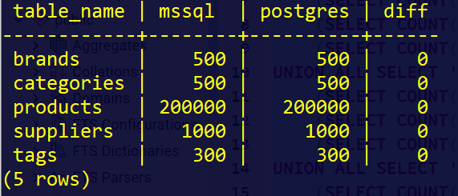

Ищу данные, которые остальсь в MS SQL и не перенеслись.
```sql
-- Бренды, отсутствующие в PostgreSQL
SELECT 
    'Brands' AS missing_type,
    COUNT(*) AS missing_count
FROM mssql_import.brands mssql
WHERE NOT EXISTS (
    SELECT 1 FROM public.brands pg 
    WHERE pg.id = mssql."Id"
);

-- Категории, отсутствующие в PostgreSQL
SELECT 
    'Categories' AS missing_type,
    COUNT(*) AS missing_count
FROM mssql_import.categories mssql
WHERE NOT EXISTS (
    SELECT 1 FROM public.categories pg 
    WHERE pg.id = mssql."Id"
);

-- Продукты, отсутствующие в PostgreSQL
SELECT 
    'Products' AS missing_type,
    COUNT(*) AS missing_count
FROM mssql_import.products mssql
WHERE NOT EXISTS (
    SELECT 1 FROM public.products pg 
    WHERE pg.id = mssql."Id"
);

-- Поставщики, отсутствующие в PostgreSQL
SELECT 
    'Suppliers' AS missing_type,
    COUNT(*) AS missing_count
FROM mssql_import.suppliers mssql
WHERE NOT EXISTS (
    SELECT 1 FROM public.suppliers pg 
    WHERE pg.id = mssql."Id"
);

-- Теги, отсутствующие в PostgreSQL
SELECT 
    'Tags' AS missing_type,
    COUNT(*) AS missing_count
FROM mssql_import.tags mssql
WHERE NOT EXISTS (
    SELECT 1 FROM public.tags pg 
    WHERE pg.id = mssql."Id"
);

-- Атрибуты продуктов, отсутствующие в PostgreSQL
SELECT 
    'Product Attributes' AS missing_type,
    COUNT(*) AS missing_count
FROM mssql_import.product_attributes mssql
WHERE NOT EXISTS (
    SELECT 1 FROM public.product_attributes pg 
    WHERE pg.id = mssql."Id"
);

-- Изображения продуктов, отсутствующие в PostgreSQL
SELECT 
    'Product Images' AS missing_type,
    COUNT(*) AS missing_count
FROM mssql_import.product_images mssql
WHERE NOT EXISTS (
    SELECT 1 FROM public.product_images pg 
    WHERE pg.id = mssql."Id"
);
```
Проверяю по таблицам остались ли какие-то записи в MS SQL, которых нет в Postgres
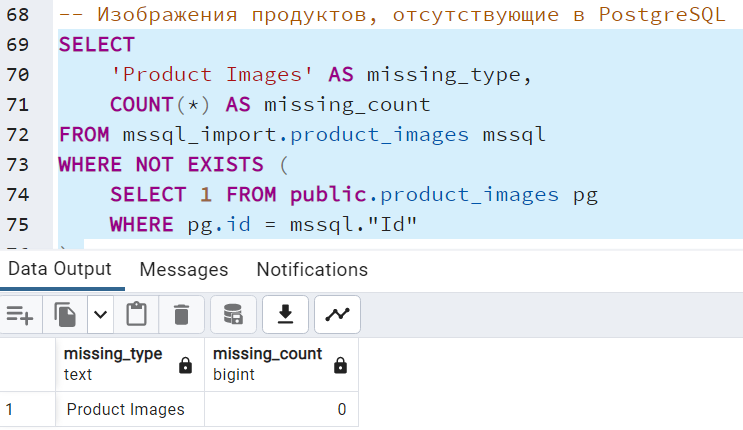
Все таблицы вернули 0 - все данные на месте.


**Сравнение уникальных записей - по ключевым полям, например имени** -Помогает выявить дубликаты или потери данных
```sql
SELECT 
    'Brands - Names' AS check_type,
    (SELECT COUNT(DISTINCT "Name") FROM mssql_import.brands) AS mssql_unique,
    (SELECT COUNT(DISTINCT name) FROM public.brands) AS postgres_unique,
    (SELECT COUNT(DISTINCT name) FROM public.brands) - (SELECT COUNT(DISTINCT "Name") FROM mssql_import.brands) AS difference;

SELECT 
    'Categories - Names' AS check_type,
    (SELECT COUNT(DISTINCT "Name") FROM mssql_import.categories) AS mssql_unique,
    (SELECT COUNT(DISTINCT name) FROM public.categories) AS postgres_unique,
    (SELECT COUNT(DISTINCT name) FROM public.categories) - (SELECT COUNT(DISTINCT "Name") FROM mssql_import.categories) AS difference;

SELECT 
    'Products - Names' AS check_type,
    (SELECT COUNT(DISTINCT "Name") FROM mssql_import.products) AS mssql_unique,
    (SELECT COUNT(DISTINCT name) FROM public.products) AS postgres_unique,
    (SELECT COUNT(DISTINCT name) FROM public.products) - (SELECT COUNT(DISTINCT "Name") FROM mssql_import.products) AS difference;

SELECT 
    'Suppliers - Names' AS check_type,
    (SELECT COUNT(DISTINCT "Name") FROM mssql_import.suppliers) AS mssql_unique,
    (SELECT COUNT(DISTINCT name) FROM public.suppliers) AS postgres_unique,
    (SELECT COUNT(DISTINCT name) FROM public.suppliers) - (SELECT COUNT(DISTINCT "Name") FROM mssql_import.suppliers) AS difference;

SELECT 
    'Tags - Names' AS check_type,
    (SELECT COUNT(DISTINCT "Name") FROM mssql_import.tags) AS mssql_unique,
    (SELECT COUNT(DISTINCT name) FROM public.tags) AS postgres_unique,
    (SELECT COUNT(DISTINCT name) FROM public.tags) - (SELECT COUNT(DISTINCT "Name") FROM mssql_import.tags) AS difference;

```

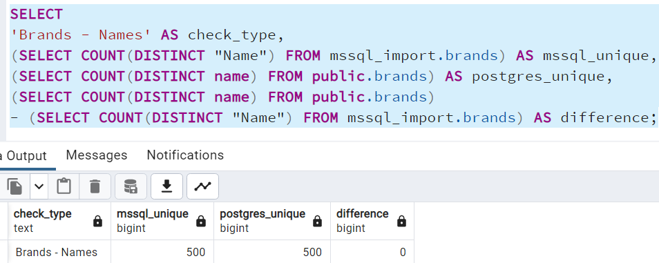


#### Размеры мигрированной базы
Размеры базы в mb
```sql
SELECT current_database() AS database_name,
ROUND(pg_database_size(current_database()) / 1024.0 / 1024.0, 2) AS total_size_mb
```
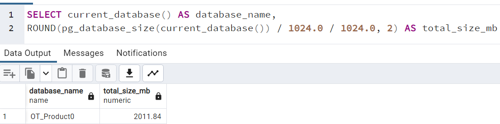
Перенесенная база с данными, занимает **2011 Мб**, что  более чем в 2 раза меньше базы на MS SQL

Размеры занимаемых таблиц
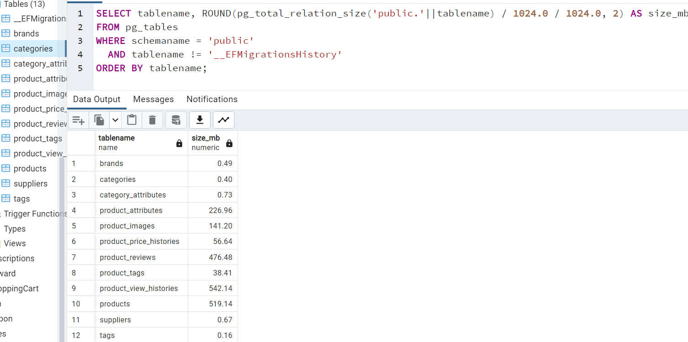

Напомню, что имели в MS SQL


#### Тест приложения после перезда на Postgres сребствами Swagger
Пробую получить товары из базы Postgres по сребствам Swagger
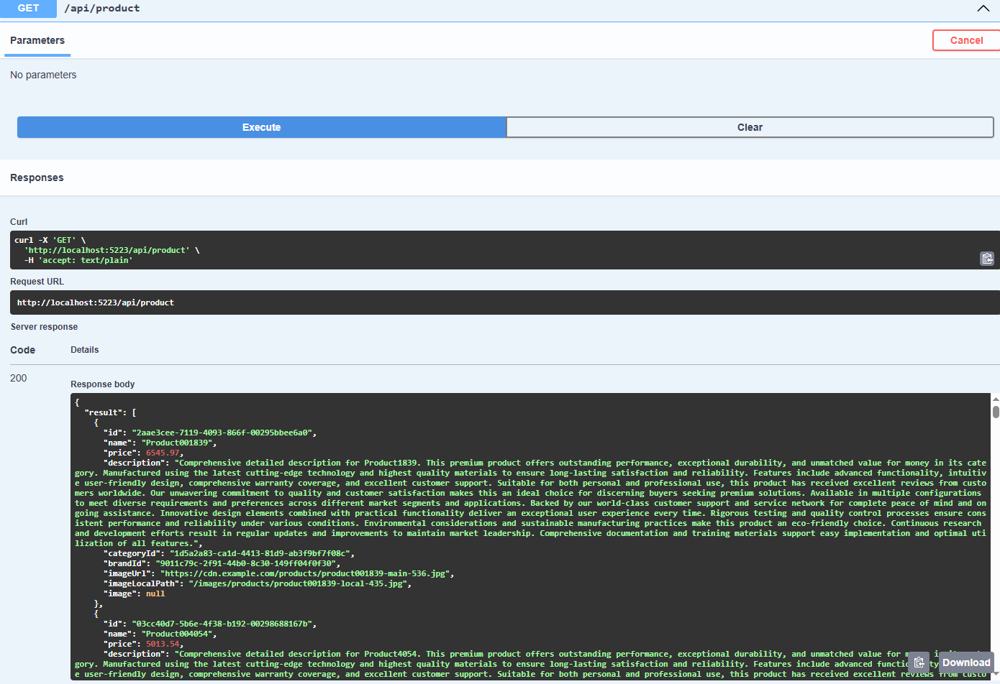
Данные приходят успешно.

Создаю новый товар, оставил для тестов  только обязательные свойства в DTO модели которая идет на запись
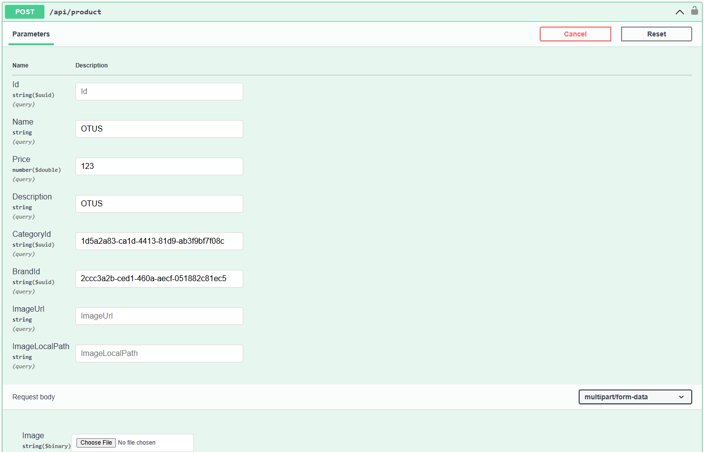
Получаю успешный ответ
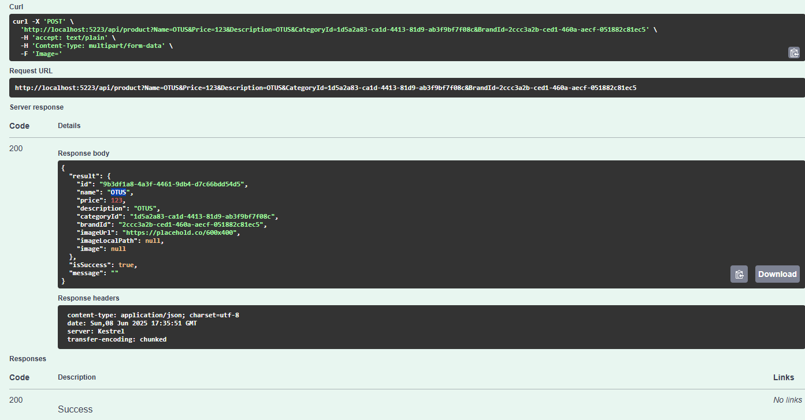

Товар должен быть создан уже в новой базе,
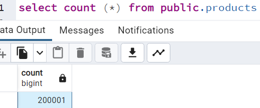
Все верно, их на 1 больше

Найду добавленный продукт в базе:
```sql
select * from public.products where name = 'OTUS'
```
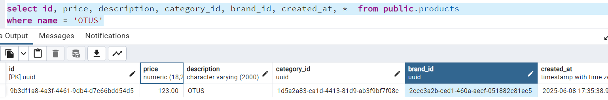
Товар в базе, зная его id = 9b3df1a8-4a3f-4461-9db4-d7c66bdd54d5 , попробую удалить
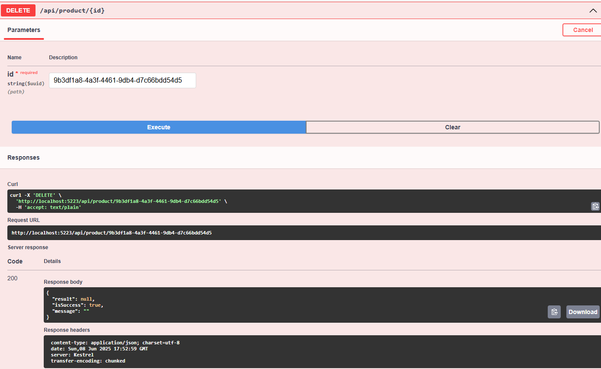
Товар успешно удален, 
**Смена базы работу сервиса не нарушила, запросы успешно проходят** 


### OT_Auth
```sql
CREATE EXTENSION tds_fdw;
```
Создал расширение  **tds_fdw**  для базы OT_Auth.  Расширения работают на уровне баз, по этому создаю для каждой базы свою.

```sql
CREATE SERVER mssql_server
FOREIGN DATA WRAPPER tds_fdw
OPTIONS (servername 'host.docker.internal', port '1433', database 'OT_Auth');
```
Создал сервер внешних данных, указывая параметры подключения к MS SQL и целевую базу OT_Auth

```sql
CREATE USER MAPPING FOR postgres
SERVER mssql_server
OPTIONS (username 'ot_user', password '1'); 
```
В Posgrtes cоздал пользовательское сопоставление.

Скрин с Foreign Data Wrapper
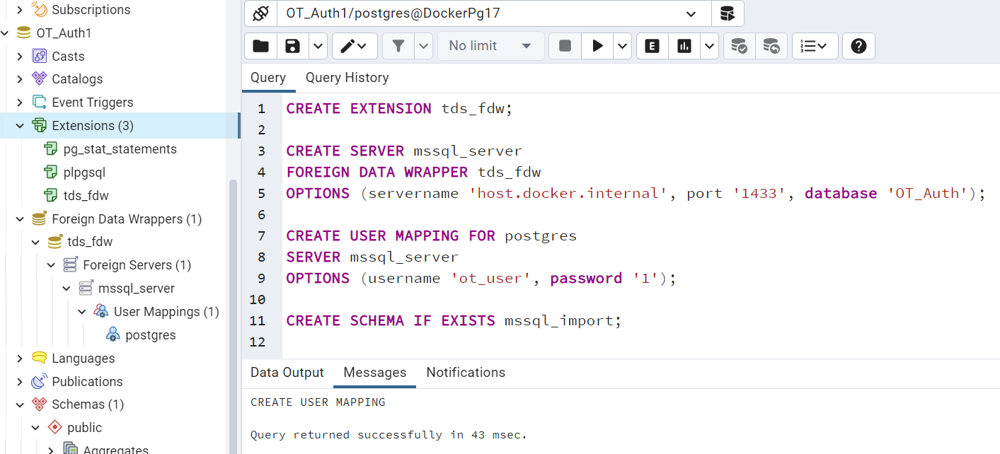

#### Создание внешних таблиц
 ```sql
CREATE SCHEMA mssql_import;
```
Создал схему для внешних таблиц, на которой далее создаю таблицы в соответствии с таблицами в MS SQL 
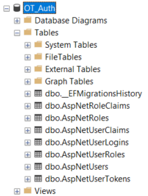

```sql
CREATE FOREIGN TABLE mssql_import.asp_net_roles (
    Id int,
    Name text,
    NormalizedName text,
    ConcurrencyStamp text
)
SERVER mssql_server
OPTIONS (schema_name 'dbo', table_name 'AspNetRoles');
```


```sql
INSERT INTO public.asp_net_roles 
SELECT * FROM mssql_import.asp_net_roles;

SELECT * FROM public.asp_net_roles
```
Перенес даные, проверил что данные целы.


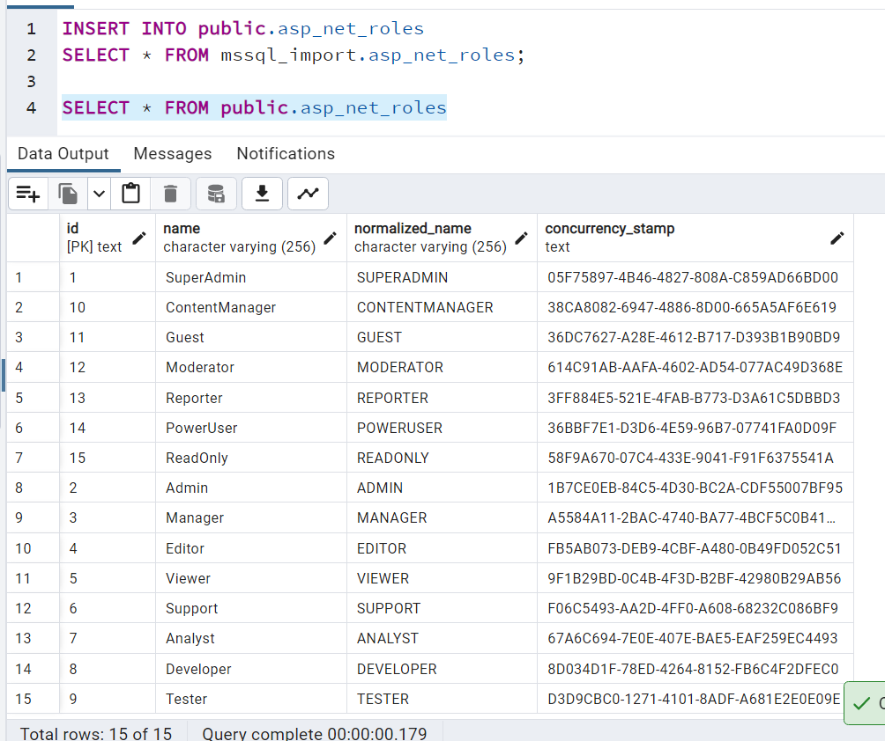

Продолжаю создавать остальные внешние таблицы 
```sql
-- AspNetRoleClaims
CREATE FOREIGN TABLE mssql_import.asp_net_role_claims (
    Id int,
    RoleId text,
    ClaimType text,
    ClaimValue text
)
SERVER mssql_server
OPTIONS (schema_name 'dbo', table_name 'AspNetRoleClaims');


-- AspNetUsers
CREATE FOREIGN TABLE mssql_import.asp_net_users (
    Id text,
    UserName text,
    NormalizedUserName text,
    Email text,
    NormalizedEmail text,
    EmailConfirmed boolean,
    PasswordHash text,
    SecurityStamp text,
    ConcurrencyStamp text,
    PhoneNumber text,
    PhoneNumberConfirmed boolean,
    TwoFactorEnabled boolean,
    LockoutEnd timestamp,
    LockoutEnabled boolean,
    AccessFailedCount int,
	Name text
)
SERVER mssql_server
OPTIONS (schema_name 'dbo', table_name 'AspNetUsers');

-- AspNetUserClaims
CREATE FOREIGN TABLE mssql_import.asp_net_user_claims (
    Id int,
    UserId text,
    ClaimType text,
    ClaimValue text
)
SERVER mssql_server
OPTIONS (schema_name 'dbo', table_name 'AspNetUserClaims');

-- AspNetUserLogins
CREATE FOREIGN TABLE mssql_import.asp_net_user_logins (
    LoginProvider text,
    ProviderKey text,
    ProviderDisplayName text,
    UserId text
)
SERVER mssql_server
OPTIONS (schema_name 'dbo', table_name 'AspNetUserLogins');

-- AspNetUserRoles
CREATE FOREIGN TABLE mssql_import.asp_net_user_roles (
    UserId text,
    RoleId text
)
SERVER mssql_server
OPTIONS (schema_name 'dbo', table_name 'AspNetUserRoles');

-- AspNetUserTokens
CREATE FOREIGN TABLE mssql_import.asp_net_user_tokens (
    UserId text,
    LoginProvider text,
    Name text,
    Value text
)
SERVER mssql_server
OPTIONS (schema_name 'dbo', table_name 'AspNetUserTokens');
```

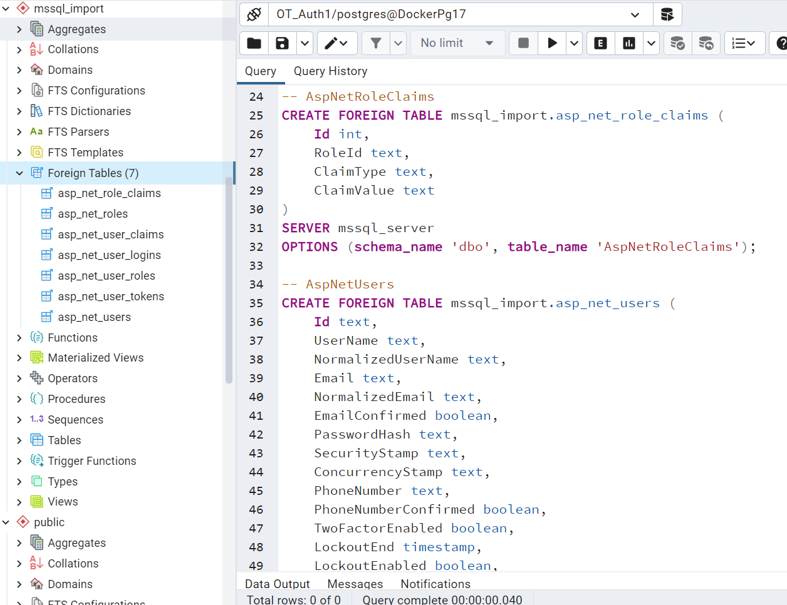

И переношу данные в последовательности нарастания зависимостей.
```sql
INSERT INTO public.asp_net_role_claims 
SELECT * FROM mssql_import.asp_net_role_claims;
```

```sql
INSERT INTO public.asp_net_users 
SELECT * FROM mssql_import.asp_net_users  
--тут получал ошибку сопоставления типов и колонок, 
--пока явно не расписал не получалось:
INSERT INTO public.asp_net_users(
id, user_name, normalized_user_name, email, normalized_email, 
	email_confirmed, 
password_hash, security_stamp, concurrency_stamp, phone_number, 
	phone_number_confirmed, 
	two_factor_enabled, 
lockout_end, lockout_enabled, access_failed_count)
SELECT 
Id, UserName, NormalizedUserName, Email, NormalizedEmail,
    EmailConfirmed::boolean,  -- Явное приведение к boolean
PasswordHash, SecurityStamp, ConcurrencyStamp, PhoneNumber, 
    PhoneNumberConfirmed::boolean, 
    TwoFactorEnabled::boolean,
LockoutEnd, 
    LockoutEnabled::boolean, 
AccessFailedCount
FROM mssql_import.asp_net_users 
```

Остальные таблицы
```sql
-- AspNetUserClaims
INSERT INTO public.asp_net_user_claims SELECT * FROM mssql_import.asp_net_user_claims;

-- AspNetUserLogins
INSERT INTO public.asp_net_user_logins SELECT * FROM mssql_import.asp_net_user_logins;

-- AspNetUserRoles
INSERT INTO public.asp_net_user_roles SELECT * FROM mssql_import.asp_net_user_roles;

-- AspNetUserTokens
INSERT INTO public.asp_net_user_tokens SELECT * FROM mssql_import.asp_net_user_tokens;
```


#### Размеры мигрированной базы
```sql
SELECT current_database() AS database_name,
ROUND(pg_database_size(current_database()) / 1024.0 / 1024.0, 2) AS total_size_mb
```
**61.66** что меньше в раза 3  базы на MS SQL
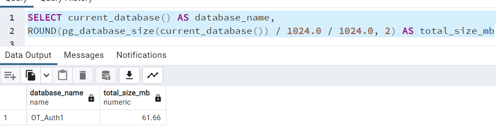

Размеры по таблицам:
```sql
SELECT tablename, ROUND(pg_total_relation_size('public.'||tablename) / 1024.0 / 1024.0, 2) AS size_mb
FROM pg_tables 
WHERE schemaname = 'public' 
  AND tablename LIKE 'asp_net%'
ORDER BY tablename;
```
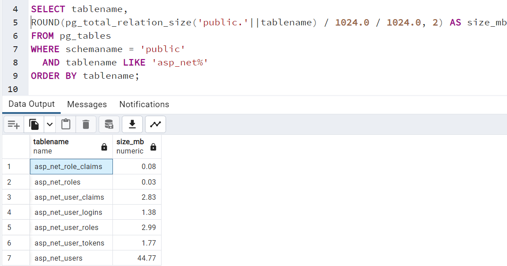

Напомню, что имели в MS SQL


И колличество записей:
```sql
SELECT 'AspNetUsers' AS table_name, COUNT(*) AS rows FROM asp_net_users
UNION ALL
SELECT 'AspNetRoles', COUNT(*) FROM public.asp_net_roles
UNION ALL
SELECT 'AspNetUserRoles', COUNT(*) FROM public.asp_net_user_roles
UNION ALL
SELECT 'AspNetUserClaims', COUNT(*) FROM public.asp_net_user_claims
UNION ALL
SELECT 'AspNetUserLogins', COUNT(*) FROM public.asp_net_user_logins
UNION ALL
SELECT 'AspNetUserTokens', COUNT(*) FROM public.asp_net_user_tokens
UNION ALL
SELECT 'AspNetRoleClaims', COUNT(*) FROM public.asp_net_role_claims
ORDER BY table_name;
```
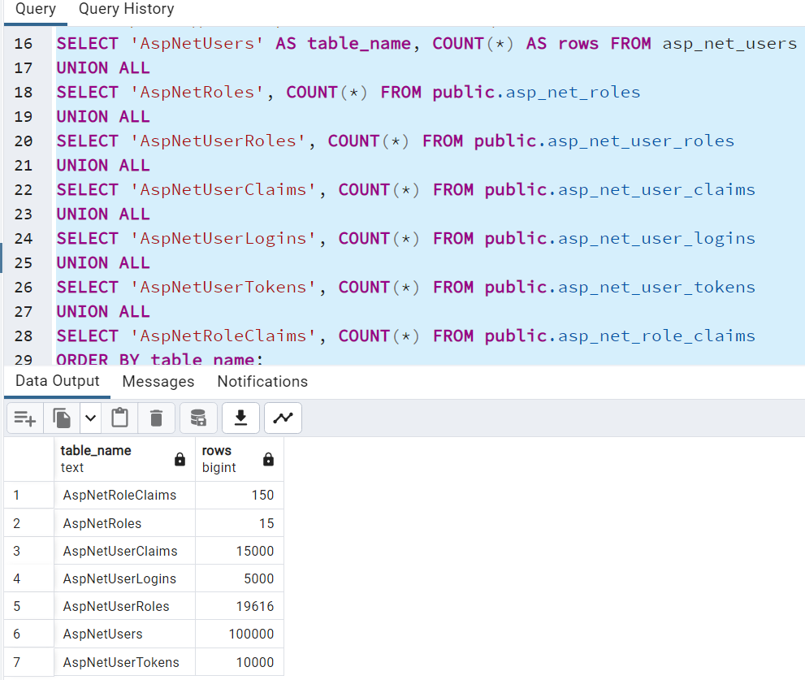
Что полностю соответствует  колличеству строк в MS SQL

Удаление всех внешних таблиц скопом можно осуществить, удалив схему
```sql
DROP SCHEMA IF EXISTS mssql_import;
```

#### Проверка целостности данных
```sql
-- Пользователи, которые остались в MS SQL, но отсутствуют в PostgreSQL (не до перенеслись)
SELECT 
'Не до перенеслись в PostgreSQL' AS missing_type,
COUNT(*) AS missing_count
FROM mssql_import.asp_net_users mssql
WHERE NOT EXISTS (
    SELECT 1 FROM public.asp_net_users pg 
    WHERE pg.id = mssql.Id
);
```
Вернул 0, значит все пользователи на месте
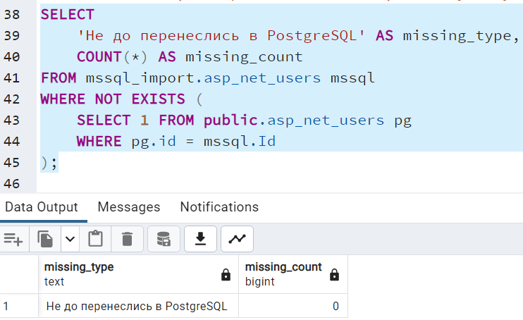

И аналогично для остальных таблиц:
```sql
-- Роли, отсутствующие в PostgreSQL
SELECT 
'Roles' AS missing_type,
COUNT(*) AS missing_count
FROM mssql_import.asp_net_roles mssql
WHERE NOT EXISTS (
    SELECT 1 FROM public.asp_net_roles pg 
    WHERE pg.id = mssql."Id"
);

-- UserRoles, отсутствующие в PostgreSQL
SELECT 
'UserRoles' AS missing_type,
COUNT(*) AS missing_count
FROM mssql_import.asp_net_user_roles mssql
WHERE NOT EXISTS (
    SELECT 1 FROM public.asp_net_user_roles pg 
    WHERE pg.user_id = mssql."UserId" AND pg.role_id = mssql."RoleId"
);

-- Claims, отсутствующие в PostgreSQL
SELECT 
'UserClaims' AS missing_type,
COUNT(*) AS missing_count
FROM mssql_import.asp_net_user_claims mssql
WHERE NOT EXISTS (
    SELECT 1 FROM public.asp_net_user_claims pg 
    WHERE pg.id = mssql."Id"
);
```
Везде возвращалось **0**
**Из чего делаем выводы все данные на месте.**

Ещё можно сделать различные проверки на уникальность значений
```sql
SELECT 
    'AspNetUsers Email' AS check_type,
    (SELECT COUNT(DISTINCT Email) FROM mssql_import.asp_net_users) AS mssql_unique_emails,
    (SELECT COUNT(DISTINCT email) FROM public.asp_net_users) AS postgres_unique_emails,
    (SELECT COUNT(DISTINCT email) FROM public.asp_net_users) - 
    (SELECT COUNT(DISTINCT Email) FROM mssql_import.asp_net_users) AS email_difference;

SELECT 
    'AspNetUsers UserName' AS check_type,
    (SELECT COUNT(DISTINCT UserName) FROM mssql_import.asp_net_users) AS mssql_unique_usernames,
    (SELECT COUNT(DISTINCT user_name) FROM public.asp_net_users) AS postgres_unique_usernames,
    (SELECT COUNT(DISTINCT user_name) FROM public.asp_net_users) - 
    (SELECT COUNT(DISTINCT UserName) FROM mssql_import.asp_net_users) AS username_difference;

-- AspNetRoles - сравнение ролей
SELECT 
    'AspNetRoles Name' AS check_type,
    (SELECT COUNT(DISTINCT Name) FROM mssql_import.asp_net_roles) AS mssql_unique_roles,
    (SELECT COUNT(DISTINCT name) FROM public.asp_net_roles) AS postgres_unique_roles,
    (SELECT COUNT(DISTINCT name) FROM public.asp_net_roles) - 
    (SELECT COUNT(DISTINCT Name) FROM mssql_import.asp_net_roles) AS roles_difference;

-- AspNetUserRoles - сравнение связей
SELECT 
    'AspNetUserRoles Unique Pairs' AS check_type,
    (SELECT COUNT(DISTINCT (UserId, RoleId)) FROM mssql_import.asp_net_user_roles) AS mssql_unique_pairs,
    (SELECT COUNT(DISTINCT (user_id, role_id)) FROM public.asp_net_user_roles) AS postgres_unique_pairs,
    (SELECT COUNT(DISTINCT (user_id, role_id)) FROM public.asp_net_user_roles) - 
    (SELECT COUNT(DISTINCT (UserId, RoleId)) FROM mssql_import.asp_net_user_roles) AS pairs_difference;
```
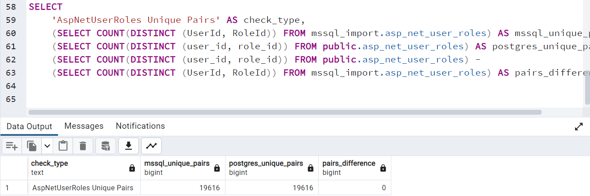
Проблем не обнаружено.

## Аналогично выполняем перенос данных и проверки для других баз, далее проводим интеграционные тесты уже в самих сервисах.

## Итоги миграции сервисов с MS SQL на PostgreSQL

Таким образом миграция баз данных из MS SQL Server в PostgreSQL выполнена успешно с применением следующих инструментов:
- Entity Framework для переноса структуры
- Расширение tds_fdw для прямого доступа к данным MS SQL и переноса данных сервисов.

**Достигнутые результаты:**
- Размер базы данных уменьшился, благодаря более эффективному хранению данных в PostgreSQL.
- Приложение полностью сохранило работоспособность без изменений в бизнес-логике.
- Переход на open-source СУБД PostgreSQL исключает расходы на лицензии MS SQL Server.
- Обеспечена совместимость с существующей инфраструктурой и процессами разработки.


